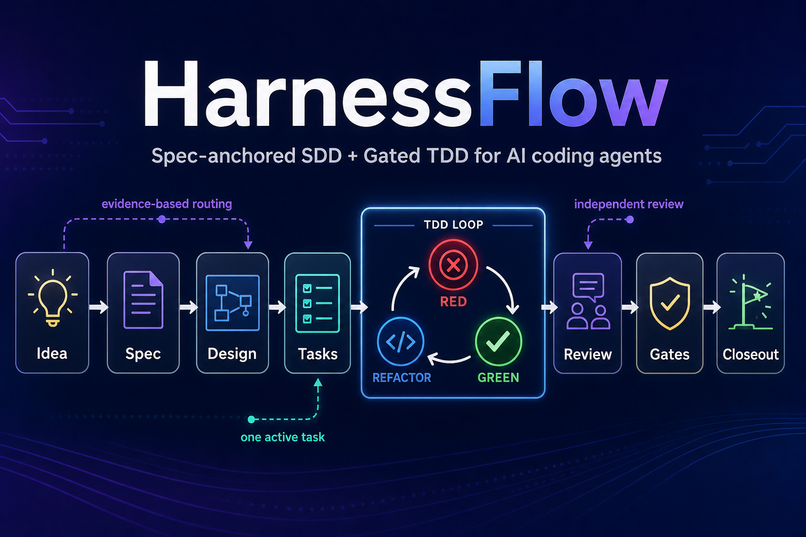

# HarnessFlow

[English](README.md) | [中文](README.zh-CN.md)

**A development-workflow skill suite for AI coding agents built on a three-layer quality model (SDD → TDD → Clean Code) with human-on-the-loop collaboration.**

HarnessFlow packages disciplined AI-assisted engineering practice into self-contained Markdown skills: specification, design, test-first implementation, independent review, defect handling, and closeout. It splits "producing high-quality code" into three layers from the outside in — SDD (build the right thing) → TDD (prove it works) → Clean Code (write it well) — with the AI doing the work in the loop and humans reviewing on the loop. Philosophy: [`docs/harnessflow-philosophy.md`](docs/harnessflow-philosophy.md). Architecture: [`docs/harnessflow-core-architecture.md`](docs/harnessflow-core-architecture.md).



---

## Commands

HarnessFlow provides 7 slash commands as a thin platform adapter. The authoritative workflow lives in `skills/<name>/SKILL.md`; commands only express intent and load the right skill.

| What you're doing | Command | Skill | Key principle |
|-------------------|---------|-------|---------------|
| Enter or resume HF | `/hf` | `using-hf` | Recover from artifacts |
| Define what to build | `/spec` | `hf-specify` | Spec before code |
| Plan how to build it | `/plan` | `hf-design` | Design before implementation |
| Build with tests | `/build` | `hf-tdd` | RED → GREEN → REFACTOR |
| Review an artifact | `/review` | `hf-review` | Authors do not self-review |
| Close engineering work | `/ship` | `hf-ship` | DoD before closeout |
| Fix a defect | `/fix` | `hf-fix` | Reproduce before repair |

`hf-clean-code`, language standards, and domain standards do not have separate commands. They are quality overlays consumed inside design, implementation, and review.

> **Commands are a bias, not a bypass.** Except for `/fix`, which directly enters the defect bypass, commands still check repository artifact evidence (`plan.md`, `reviews/`) before entering the right stage.

---

## Quick Start

### Claude Code

Install from the marketplace:

```text
/plugin marketplace add https://github.com/hujianbest/harness-flow.git
/plugin install harness-flow@hujianbest-harness-flow
```

### OpenCode and Cursor

Vendor HarnessFlow into your project with the install script (writes a manifest for clean uninstall):

```bash
git clone https://github.com/hujianbest/harness-flow.git /path/to/harness-flow

# OpenCode
bash /path/to/harness-flow/install.sh --target opencode --host /path/to/your/project

# Cursor
bash /path/to/harness-flow/install.sh --target cursor --host /path/to/your/project

# Both
bash /path/to/harness-flow/install.sh --target both --host /path/to/your/project
```

The script copies or symlinks `skills/`, `agents/`, OpenCode command assets, and Cursor agent mirrors, places client-specific rules, and writes `.harnessflow-install-manifest.json` so uninstall can remove only HF-managed files.

### Try it

```text
Use HarnessFlow from this repo. Start with `using-hf` and route me to the right stage.
I want to add a retry mechanism to the notifications component.
Clarify the requirements first; do not jump straight to code.
```

Project overrides: create an `AGENTS.md` with a `## Project overrides` section at the target component repository root to override artifact paths and templates. Without it, the `using-hf` built-in defaults apply.

More setup detail: [Claude Code setup](docs/claude-code-setup.md), [OpenCode setup](docs/opencode-setup.md), [Cursor setup](docs/cursor-setup.md).

---

## See It Work

```text
You:    Use HarnessFlow from this repo. Add rate limiting to the notifications API.
        Do not jump straight to code.

HF:     Enters via `using-hf`, confirms the run mode (attended / unattended), resolves
        the target component root, and routes into `hf-specify` because no approved
        spec exists.

You:    Continue with HarnessFlow once the spec is ready.

HF:     Runs an independent `hf-review` gate (R1). If the spec passes and the run mode
        allows progress, `hf-design` writes component-level and work-item-level design,
        interface contracts, error model, and test design.

You:    Build the approved design.

HF:     `hf-tdd` refines `plan.md`, implements one task at a time with RED → GREEN →
        REFACTOR evidence, applies `hf-clean-code` plus the applicable language/domain
        standards, and writes evidence lines to disk.

You:    Verify and close the work.

HF:     `hf-review` checks tests and code from an independent context (R3). `hf-ship`
        runs the Definition of Done, promotes long-term assets into the component
        root's docs/, and writes `closeout.md` for human final confirmation.
```

At workflow start HarnessFlow records one run mode: `attended` by default (review verdicts pause for human confirmation), or `unattended`, where long sessions keep moving while independent reviews, records, critical-finding stops, and later human audit all remain mandatory — **unattended only removes the human pause, not any quality action**.

---

## All 15 Skills

HarnessFlow currently ships 15 skills in four categories. Overlays and domain skills are discovered by naming convention and description, so new overlays can be added without changing the phase skills.

### Phase Skills (7)

Have a workflow, produce artifacts, and carry a human checkpoint. `using-hf` is the entry skill; the other six are workflow stages.

| Skill | What it does | Use when |
|-------|--------------|----------|
| [using-hf](skills/using-hf/SKILL.md) | Entry: three-layer model, workflow loop, artifact conventions, recovery rules, behavior rules | Starting, resuming, or asking what HF should do next |
| [hf-specify](skills/hf-specify/SKILL.md) | Turns intent into a testable spec (EARS + Given/When/Then + NFR QAS) and initializes the traceability matrix | A feature/change needs requirements before design or code |
| [hf-design](skills/hf-design/SKILL.md) | Produces component-level and work-item-level design, boundaries, contracts, error model, tradeoffs, and test design | An approved spec needs technical design |
| [hf-tdd](skills/hf-tdd/SKILL.md) | Test-first implementation (RED → GREEN → REFACTOR), task evidence, assertion quality, and mock-boundary discipline | Design is approved and implementation starts |
| [hf-review](skills/hf-review/SKILL.md) | Independently reviews specs, designs, tests, or code with findings and verdicts | A phase artifact is ready to pass a gate |
| [hf-ship](skills/hf-ship/SKILL.md) | Checks the Definition of Done, promotes long-term assets, and writes closeout | Reviews are closed and engineering work is ready to finish |
| [hf-fix](skills/hf-fix/SKILL.md) | Defect path: reproduction → root cause → minimal fix boundary → TDD repair | A regression, bug, hotfix, or shipped-behavior defect appears |

### Quality Overlays (5)

Quality constraints and criteria spanning all stages, referenced by phase skills, but not stages themselves. `hf-clean-code` is the language-neutral core of layer three; language standards are discovered by `<language>-coding-standards` naming convention.

| Skill | What it does | Use when |
|-------|--------------|----------|
| [hf-clean-code](skills/hf-clean-code/SKILL.md) | Language-neutral clean code standards: naming, functions, control flow, errors, comments, refactoring catalog | Writing, refactoring, or reviewing implementation and test code |
| [c-coding-standards](skills/c-coding-standards/SKILL.md) | C language-level rules, idioms, tooling discipline, and examples | Work touches C source, tests, or build scripts |
| [cpp-coding-standards](skills/cpp-coding-standards/SKILL.md) | C++ language-level rules, idioms, tooling discipline, and examples | Work touches C++ source, tests, or build scripts |
| [java-coding-standards](skills/java-coding-standards/SKILL.md) | Java language-level rules, idioms, tooling discipline, and examples | Work touches Java source, tests, or build scripts |
| [python-coding-standards](skills/python-coding-standards/SKILL.md) | Python language-level rules, idioms, tooling discipline, and examples | Work touches Python source, tests, or build scripts |

### Domain Skills (2)

Domain-specific quality dimensions, triggered by their frontmatter descriptions.

| Skill | What it does | Use when |
|-------|--------------|----------|
| [backend-development](skills/backend-development/SKILL.md) | Backend domain design constraints, implementation red lines, and evidence requirements | Work context matches the backend domain skill's description |
| [frontend-development](skills/frontend-development/SKILL.md) | Frontend domain design constraints, implementation red lines, and evidence requirements | Work context matches the frontend domain skill's description |

### Tooling (1)

| Skill | What it does | Use when |
|-------|--------------|----------|
| [coding-standards-creator](skills/coding-standards-creator/SKILL.md) | Converts a team's internal coding standards into a new `<language>-coding-standards` skill | A team needs to add or revise a language standard |

Language standards extend by convention: work touching language X can load `<x>-coding-standards` when present. New language skills follow the shared [structural contract](skills/coding-standards-creator/references/coding-standards-skill-contract.md), so phase skills do not need to be rewritten for each language.

---

## The HarnessFlow Method (three-layer quality model + workflow)

HarnessFlow is not a prompt collection. It is an evidence-based workflow for getting AI agents to produce code that can be reviewed, trusted, and maintained. The three layers progress from the outside in: ensure the right thing, then prove it correct, then write it well.

| Layer | HF method | Why it matters |
|-------|-----------|----------------|
| Intent (Layer 1 SDD) | Spec-driven development (`hf-specify`) | Prevents the agent from guessing requirements |
| Planning | Component + work-item design (`hf-design`) | Makes boundaries, contracts, errors, and tests explicit before code |
| Execution (Layer 2 TDD) | Test-driven development (`hf-tdd`) | Separates "it looks right" from behavior proven by tests |
| Internal quality (Layer 3 Clean Code) | Clean Code overlays (`hf-clean-code` + language/domain standards) | Keeps code readable, simple, maintainable, and reviewable |
| Review | Independent gates (`hf-review`) | Keeps authorship and judgment separate |
| Recovery | Artifact-first state (`plan.md` + `reviews/`) | Lets another agent or human resume from files, not chat memory |
| Closeout | DoD and promotion (`hf-ship`) | Records what changed, what passed, and which docs became durable assets |

HarnessFlow's collaboration stance is **human-on-the-loop**: the AI does the work, and humans review the key artifacts and decisions. See [docs/harnessflow-philosophy.md](docs/harnessflow-philosophy.md) and [docs/harnessflow-core-architecture.md](docs/harnessflow-core-architecture.md).

---

## How Skills Work

Each skill is a self-contained operating procedure:

```text
SKILL.md
├── Trigger conditions
├── Workflow steps
├── Required artifacts
├── Evidence and review contracts
├── Quality rules and examples
├── Red flags and rationalization traps
└── Verification checklist
```

Key design choices:

- **Minimal process.** Keep only what produces quality: phase artifacts, human checkpoints, TDD discipline, and independent reviews; no extra node router.
- **Maximal substance.** The body of each skill is engineering judgment: rules + positive/negative examples + checklists + review rubrics.
- **Evidence over memory.** Progress is recovered from `plan.md`, `reviews/`, `traceability.md`, and the artifact files themselves, not chat history.
- **Authors do not self-review.** The agent that creates an artifact does not approve it.

---

## Project Structure

```text
harness-flow/
├── skills/                         # 15 skills (7 phase + 5 overlay + 2 domain + 1 tool)
│   ├── using-hf/                   # Phase: entry and recovery rules
│   ├── hf-specify/                 # Phase: testable specs and traceability
│   ├── hf-design/                  # Phase: component + work-item design
│   ├── hf-tdd/                     # Phase: test-first implementation
│   ├── hf-review/                  # Phase: independent review gates
│   ├── hf-ship/                    # Phase: DoD, promotion, closeout
│   ├── hf-fix/                     # Phase: defect path
│   ├── hf-clean-code/              # Overlay: language-neutral clean code
│   ├── c-coding-standards/         # Overlay: C language standard
│   ├── cpp-coding-standards/       # Overlay: C++ language standard
│   ├── java-coding-standards/      # Overlay: Java language standard
│   ├── python-coding-standards/    # Overlay: Python language standard
│   ├── backend-development/        # Domain: backend
│   ├── frontend-development/       # Domain: frontend
│   └── coding-standards-creator/   # Tooling: language-standard generator
├── commands/                       # 7 slash-style phase entries
├── agents/                         # hf-implementer and hf-reviewer personas
├── .claude-plugin/                 # Claude Code marketplace plugin metadata
├── .cursor/rules/                  # Cursor alwaysApply entry rule
├── .opencode/                      # OpenCode integration assets
├── docs/
│   ├── harnessflow-philosophy.md   # Core philosophy (north star)
│   ├── harnessflow-core-architecture.md
│   ├── claude-code-setup.md
│   ├── opencode-setup.md
│   ├── cursor-setup.md
│   ├── decisions/                  # ADRs
│   └── assets/
├── scripts/                        # Repository consistency checks
├── tests/                          # Repository-level validators and regressions
├── install.sh / uninstall.sh
├── install.ps1 / uninstall.ps1
└── README.zh-CN.md
```

When vendoring HarnessFlow into another project, copy `skills/` plus `agents/`, or use `install.sh`. Each skill owns its `SKILL.md`, `references/`, `evals/`, and optional `scripts/`; shared subagent roles live in `agents/`, and slash-command definitions live in `commands/`.

---

## Scope

HarnessFlow covers the engineering segment from an accepted requirement to a reviewed implementation and closeout. It does not cover product discovery, release operations (deployment, staged rollout, monitoring, rollback), system/integration/acceptance testing, incident management, or production rollout. It also does not make business direction, priority, acceptance-threshold, or architecture-boundary decisions on behalf of the team.

---

## Contributing

See [CONTRIBUTING.md](CONTRIBUTING.md). Keep skills concrete, verifiable, example-driven, and light on process boilerplate.

---

## License

MIT — use HarnessFlow in your projects, teams, and tools.
