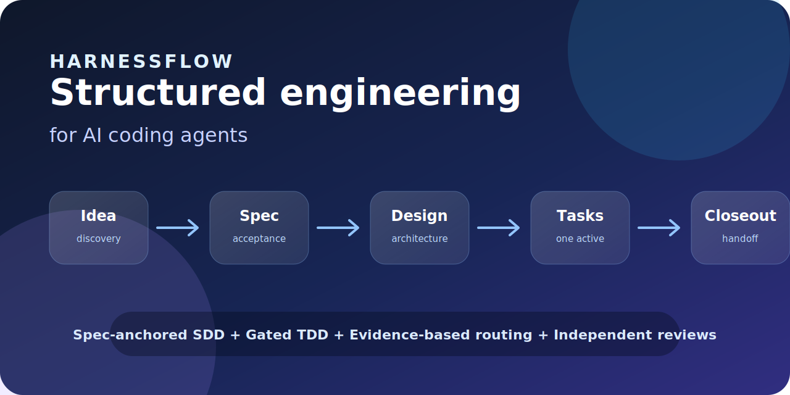

# HarnessFlow

[English](README.md) | [Chinese](README.zh-CN.md)

**Spec-anchored SDD, gated TDD, and evidence-based workflow control for AI coding agents.**

HarnessFlow packages the practices behind disciplined AI-assisted engineering into self-contained Markdown skills: discovery, specs, design, tasks, TDD implementation, independent reviews, gates, and closeout.



---

## Commands

Claude Code gets 7 slash commands. OpenCode and Cursor use the same intents through natural language plus `using-hf-workflow`.

| What you're doing | Command | Key principle |
|-------------------|---------|---------------|
| Enter or resume HF | `/hf` | Route from artifacts |
| Define what to build | `/spec` | Spec before code |
| Plan how to build it | `/plan` | Design then tasks |
| Build one task | `/build` | One active task |
| Review before moving on | `/review` | Author/reviewer separation |
| Close engineering work | `/ship` | Gates before closeout |
| Cut a release pack | `/release` | Version docs, not deploys |

Every command is a bias, not a bypass. The router still checks repository evidence before choosing the next node, except `/release`, which directly invokes the standalone release skill.

---

## Quick Start

### Claude Code

Install from the marketplace:

```text
/plugin marketplace add https://github.com/hujianbest/harness-flow.git
/plugin install harness-flow@hujianbest-harness-flow
```

### OpenCode and Cursor

Vendor HarnessFlow into your project with the install script:

```bash
git clone https://github.com/hujianbest/harness-flow.git /path/to/harness-flow

# OpenCode
bash /path/to/harness-flow/install.sh --target opencode --host /path/to/your/project

# Cursor
bash /path/to/harness-flow/install.sh --target cursor --host /path/to/your/project

# Both
bash /path/to/harness-flow/install.sh --target both --host /path/to/your/project
```

The script copies or symlinks `skills/`, places client-specific rules, and writes `.harnessflow-install-manifest.json` so uninstall can remove only HF-managed files.

### Try it

```text
Use HarnessFlow from this repo. Start with `using-hf-workflow` and route me through the correct HF workflow.
I want to add rate limiting to our notifications API.
Do not jump straight to code.
```

More setup detail:

- [Claude Code setup](docs/claude-code-setup.md)
- [OpenCode setup](docs/opencode-setup.md)
- [Cursor setup](docs/cursor-setup.md)

---

## All 29 Skills

HarnessFlow currently ships 28 `hf-*` skills plus the `using-hf-workflow` entry skill.

### Meta and routing

| Skill | What it does | Use when |
|-------|--------------|----------|
| [using-hf-workflow](skills/using-hf-workflow/SKILL.md) | Public entry shell for choosing direct invoke vs router handoff | Starting a session or expressing a high-level HF intent |
| [hf-workflow-router](skills/hf-workflow-router/SKILL.md) | Evidence-based runtime router and recovery controller | Continuing from repository artifacts or consuming review/gate outcomes |

### Discover and define

| Skill | What it does | Use when |
|-------|--------------|----------|
| [hf-product-discovery](skills/hf-product-discovery/SKILL.md) | Frames product opportunity, assumptions, JTBD, and success signals | The idea is still at product-discovery level |
| [hf-discovery-review](skills/hf-discovery-review/SKILL.md) | Reviews discovery artifacts with author/reviewer separation | Discovery output needs an independent verdict |
| [hf-experiment](skills/hf-experiment/SKILL.md) | Runs smallest useful probes for blocking hypotheses | A discovery or spec assumption is too risky to guess |
| [hf-specify](skills/hf-specify/SKILL.md) | Turns intent into testable requirements and acceptance criteria | Writing or revising a spec |
| [hf-spec-review](skills/hf-spec-review/SKILL.md) | Reviews specs against clarity, completeness, and testability | A spec is ready for independent review |

### Plan

| Skill | What it does | Use when |
|-------|--------------|----------|
| [hf-design](skills/hf-design/SKILL.md) | Produces architecture, interfaces, risks, and decisions | An approved spec needs technical design |
| [hf-design-review](skills/hf-design-review/SKILL.md) | Reviews design for traceability and architectural quality | A design draft is ready |
| [hf-ui-design](skills/hf-ui-design/SKILL.md) | Designs UI flows, IA, states, tokens, and accessibility | The spec declares a UI surface |
| [hf-ui-review](skills/hf-ui-review/SKILL.md) | Reviews UI design against UX and accessibility criteria | UI design needs an independent verdict |
| [hf-tasks](skills/hf-tasks/SKILL.md) | Breaks approved design into small, ordered tasks | Design is approved and implementation needs a task plan |
| [hf-tasks-review](skills/hf-tasks-review/SKILL.md) | Checks task atomicity, dependencies, and verification clarity | Task plan is ready |
| [hf-gap-analyzer](skills/hf-gap-analyzer/SKILL.md) | Author-side gap check before formal review | An artifact needs self-checking before review |

### Build, verify, and review

| Skill | What it does | Use when |
|-------|--------------|----------|
| [hf-test-driven-dev](skills/hf-test-driven-dev/SKILL.md) | Implements one active task with test design, RED/GREEN evidence, and refactor discipline | A single current task is locked |
| [hf-browser-testing](skills/hf-browser-testing/SKILL.md) | Captures browser DOM, console, and network evidence | A frontend task needs runtime proof |
| [hf-test-review](skills/hf-test-review/SKILL.md) | Reviews test quality and fail-first evidence | Tests are ready for independent review |
| [hf-code-review](skills/hf-code-review/SKILL.md) | Reviews implementation quality, design conformance, and AI-slop risks | Code is ready for independent review |
| [hf-traceability-review](skills/hf-traceability-review/SKILL.md) | Checks spec -> design -> tasks -> code -> verification alignment | Implementation reviews passed |
| [hf-regression-gate](skills/hf-regression-gate/SKILL.md) | Runs impact-based regression judgment | Traceability is approved |
| [hf-doc-freshness-gate](skills/hf-doc-freshness-gate/SKILL.md) | Checks changed behavior and docs stay in sync | Regression evidence is ready |
| [hf-completion-gate](skills/hf-completion-gate/SKILL.md) | Decides whether task/workflow evidence is enough to complete | Reviews and gates need a final completion verdict |

### Closeout, release, branches, and acceleration

| Skill | What it does | Use when |
|-------|--------------|----------|
| [hf-finalize](skills/hf-finalize/SKILL.md) | Writes closeout pack and HTML companion | Completion gate allows workflow closeout |
| [hf-release](skills/hf-release/SKILL.md) | Aggregates closed workflows into a tag-ready release pack | Cutting a vX.Y.Z release |
| [hf-hotfix](skills/hf-hotfix/SKILL.md) | Handles defect recovery with root-cause discipline | The request is a production or shipped-behavior defect |
| [hf-increment](skills/hf-increment/SKILL.md) | Re-enters the workflow for scope or acceptance changes | Requirements changed after prior artifacts |
| [hf-wisdom-notebook](skills/hf-wisdom-notebook/SKILL.md) | Maintains cross-task learnings, decisions, issues, verification, and problems | Work needs reusable memory across tasks |
| [hf-context-mesh](skills/hf-context-mesh/SKILL.md) | Generates client-specific context skeletons | A project needs layered agent instructions |
| [hf-ultrawork](skills/hf-ultrawork/SKILL.md) | Explicit-opt-in fast lane that still preserves reviews, gates, and approval records | The architect asks for auto execution under HF rules |

---

## The HF Method

HarnessFlow is not a prompt collection. It is a controlled engineering workflow for agents.

| Layer | HF method | Why it matters |
|-------|-----------|----------------|
| Intent | Spec-anchored SDD | Keeps scope, constraints, and acceptance criteria in reviewable files |
| Planning | Design and task gates | Turns approved intent into architecture and atomic implementation units |
| Execution | Gated TDD | Requires test design, RED/GREEN evidence, and one active task at a time |
| Routing | Artifact-based recovery | Lets agents resume from repository state instead of chat memory |
| Review | Fagan-style separation | Keeps authoring, implementation, and judgment from collapsing into one step |
| Verification | Regression and completion gates | Separates "tests ran" from "evidence is sufficient" |
| Closeout | Formal handoff | Records what changed, what passed, and what remains |

HF deliberately stops at engineering closeout. It can produce a release-ready pack, but it does not deploy, stage rollouts, monitor production, or claim post-launch success.

---

## How Skills Work

Each skill is a self-contained workflow:

```text
SKILL.md
├── Overview and trigger conditions
├── Step-by-step workflow
├── Required artifacts and evidence
├── Review or gate contract
├── Red flags
├── Common rationalizations
└── Verification checklist
```

Key design choices:

- **Process, not prose.** Skills are operating procedures agents follow.
- **Evidence over memory.** Routing reads files such as `progress.md`, reviews, approvals, and verification records.
- **Author/reviewer separation.** The author of an artifact does not approve it.
- **Progressive disclosure.** References, rubrics, scripts, and evals live beside the owning skill and load only when needed.

---

## Project Structure

```text
harness-flow/
├── skills/                         # Redistributable skill pack
│   ├── using-hf-workflow/
│   ├── hf-workflow-router/
│   ├── hf-specify/
│   ├── hf-design/
│   ├── hf-test-driven-dev/
│   ├── hf-finalize/
│   └── ...                         # one folder per skill
├── docs/
│   ├── claude-code-setup.md
│   ├── opencode-setup.md
│   ├── cursor-setup.md
│   ├── decisions/                  # ADRs
│   ├── principles/                 # HF design notes
│   └── assets/
├── examples/writeonce/             # end-to-end demo artifacts
├── install.sh / uninstall.sh
└── README.zh-CN.md
```

When vendoring HarnessFlow into another project, copy `skills/` only or use `install.sh`. The `docs/principles/` directory explains this repository's design; it is not a runtime dependency for hosted projects.

---

## Why HarnessFlow?

AI coding agents often jump from request to implementation. HarnessFlow makes the hidden senior-engineering work explicit: clarify intent, design before slicing work, prove behavior with tests, separate reviews from authorship, and close the loop with durable artifacts.

It is useful when correctness, recoverability, and auditability matter more than getting to first code as fast as possible.

---

## Contributing

See [CONTRIBUTING.md](CONTRIBUTING.md). Keep skills specific, verifiable, minimal, and grounded in real engineering practice.

---

## License

MIT - use HarnessFlow in your projects, teams, and tools.
