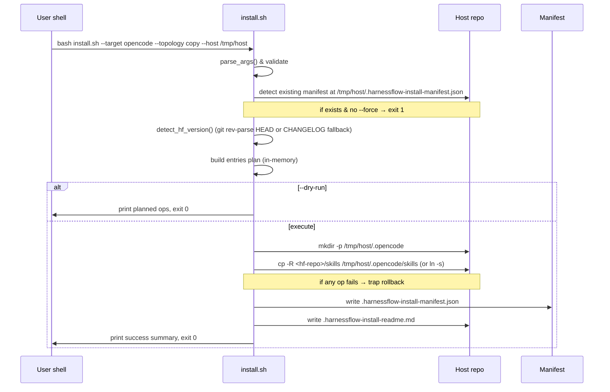
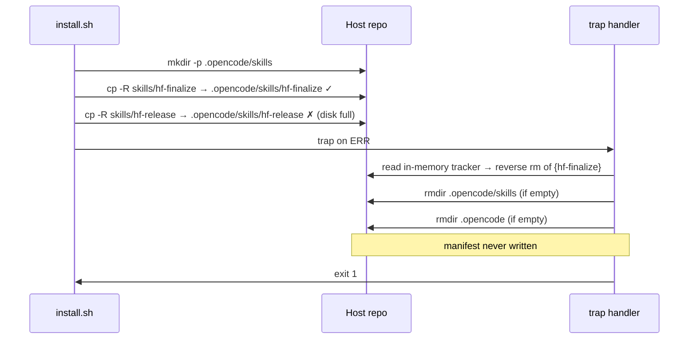

# HarnessFlow 安装脚本（Cursor / OpenCode）实现设计

- 状态: 草稿
- 主题: install.sh / uninstall.sh 的实现设计
- 关联 spec: `features/001-install-scripts/spec.md`（approved 2026-05-11）
- 关联 ADR: `docs/decisions/ADR-007-install-scripts-topology-and-manifest.md`（proposed）
- Workflow Profile: full
- UI Surface: **不激活 hf-ui-design**（CLI-only feature，无 UI）

## 1. 概述

实现两个落在 HF 仓库根目录的 bash 脚本——`install.sh` 与 `uninstall.sh`——把 HF 的 24 个 hf-* skills + `using-hf-workflow` 与 `.cursor/rules/harness-flow.mdc` vendor 进任意宿主仓库，覆盖 Cursor / OpenCode / both 三个 target × copy / symlink 两个 topology = 6 个组合。所有 install 操作记录到宿主仓库根 `.harnessflow-install-manifest.json`，uninstall 严格基于该 manifest 反向清理。

设计严格遵守 ADR-007 的 5 个关键决策（D1 纯 shell、D2 manifest 唯一权威、D3 不依赖 jq、D4 cursor vendor 路径、D5 post-install readme）。

## 2. 设计驱动因素

承接 spec：

- **NFR-001 Installability**：单条命令完成，bash + POSIX coreutils 即可运行
- **NFR-002 Reliability**：中途失败可回滚，不留半装状态
- **NFR-003 Testability**：6 组合 e2e 测试矩阵
- **NFR-004 Maintainability**：bash 3.2+ 兼容，无 jq/python/node 依赖
- **FR-008**：4 类子目录（含 ADR-006 D1 的 `scripts/`）一并搬运
- **ASM-001**：HF 非 git checkout 时 `hf_commit` 降级为 `unknown-non-git-checkout`，`hf_version` 从 CHANGELOG 解析

## 3. 需求覆盖与追溯

| 需求 ID | Statement 摘要 | 设计承接位置 |
|---|---|---|
| FR-001 | install.sh `--target` | §11 install.sh `cmd_install()` + §13 CLI 契约 |
| FR-002 | copy / symlink topology | §11 `vendor_skills_opencode()` + `vendor_cursor()` 的 topology 分支 |
| FR-003 | manifest 写入 + schema | §11 `write_manifest()` + §13 manifest schema |
| FR-004 | uninstall.sh | §11 `cmd_uninstall()` + §13 manifest 读取流程 |
| FR-005 | `--dry-run` | §11 `DRY_RUN` 全局变量 + §12 `op()` 抽象 |
| FR-006 | `--force` 重复 install 处理 | §11 `cmd_install()` 入口 manifest 探测 |
| FR-007 | `--verbose` | §11 `VERBOSE` 全局 + `log()` 函数 |
| FR-008 | 4 类子目录搬运 | §11 `vendor_skills_opencode()` / `vendor_cursor()` 中 `op CP "$HF_REPO/skills/$name" ...` 整 skill 子树 cp（自然包含 `scripts/`）+ §16 e2e 测试用例 #6 |
| NFR-001 | Installability QAS | §10 C4 Container view + §11 主流程 + §16 e2e 测试 |
| NFR-002 | 失败回滚 | §11 `trap rollback ERR INT TERM` + §17 失败模式表 |
| NFR-003 | 6 组合 e2e | §16 测试矩阵 |
| NFR-004 | 无新依赖 + bash 3.2+ | §11 编码约束（不用 mapfile / 关联数组等 4+ 特性）+ §16 测试用例 #7 grep |
| ASM-001 | 非 git checkout 降级 | §11 `detect_hf_version()` + manifest schema |

## 4. Domain Strategic Model (Bounded Context / Ubiquitous Language / Context Map)

**显式跳过本章节**。理由：本 feature 是单脚本工具（CLI 安装器），无多业务概念 / 无多角色 / 无跨系统业务集成，只有"vendor 文件 + 维护 manifest"两个紧耦合关注点，强行套 Bounded Context 是 over-modeling（违反 hf-design SKILL.md 的 YAGNI 立场）。

唯一相关的"语言"是脚本 CLI 表面的术语（target / topology / manifest / vendor），已在 spec §14 Glossary 定义。

## 4.5 Tactical Model per Bounded Context

**显式跳过本章节**。理由：未触发任何 tactical model 触发条件——

- Bounded Context 数量 = 1（视作单 Context "vendor 安装器"）
- 单 Context 内不存在多实体 + 跨实体一致性约束（manifest 是唯一聚合，schema 字段固定）
- 不存在并发修改 / 事务边界（脚本是单进程顺序执行）
- 不存在领域事件（无业务状态变化广播）

按 hf-design SKILL.md：未触发即显式跳过。

## 5. Event Storming Snapshot（full profile）

按 full profile 提供 Event Timeline + Process Modeling。本 feature 的"事件"是 install / uninstall 子命令执行过程中的关键状态转移。

### 5.1 Event Timeline (install happy path)



### 5.2 Event Timeline (failure rollback)



### 5.3 Process Modeling — Hotspot 标记

| Hotspot | 类型 | 处理 |
|---|---|---|
| H1: rollback 中 `rm` 自身失败 | 设计争议 | ADR-007 D2 决定 manifest 不落盘（要么完整要么不存在），rollback 失败时打印明确错误并退出非 0；不二次尝试 |
| H2: HF 仓库与宿主仓库是同一个目录（`--host .` 在 HF 仓库根执行） | 边界条件 | 脚本入口 `validate_args()` 检测 `<HF-repo-root>` == `<host>` 时拒绝执行（因为会形成自我 vendor） |
| H3: macOS bash 3.2 上 `printf '%s\0'` 与 `read -d ''` 行为差异 | 兼容性 | §11 编码约束明确不用 null-delimited 处理；用 newline-delimited + 引用所有变量 |

## 6. 架构模式选择

**模式名称**：单文件 shell pipeline / Plan-then-Apply

- **Plan-then-Apply**：先在 in-memory 数组里构建 `ENTRIES` 计划列表（path + kind），再统一 apply；`--dry-run` 在 plan 完成后退出，复用同一份 plan
- **不引入**：插件机制、配置文件、多文件 sourcing（会增加用户阅读成本）

理由匹配 ADR-007 D1（纯 shell）+ ADR-007 D3（manifest schema 受控扁平）。

## 7. 候选方案总览

| 方案 | 一句话 |
|---|---|
| A | 纯 bash + manifest（**选定**）|
| B | Node.js wrapper（参考 ECC `install.sh` 委托给 `scripts/install-apply.js`）|
| C | Python stdlib（参考 `skills/hf-finalize/scripts/render-closeout-html.py` 路径）|

## 8. 候选方案对比与 trade-offs

| 方案 | 核心思路 | 优点 | 主要代价 / 风险 | NFR / 约束适配 (对 QAS) | 对 Success Metrics 的影响 | 可逆性 |
|------|----------|------|------------------|--------------------------|----------------------------|--------|
| A 纯 bash + manifest（选定）| install.sh / uninstall.sh 直接用 bash 实现，所有 shell 脚本可读；manifest 用 printf 拼出 JSON | 零新增运行时；6 组合矩阵在 macOS bash 3.2 + Linux bash 5.x 都能跑；与 HF 自身依赖最小化哲学一致；用户只需 bash | bash 3.2 兼容意味着放弃 mapfile/关联数组；纯 shell JSON 写入对 schema 演进不如 jq 灵活 | NFR-001 ✓单条命令；NFR-002 ✓ trap 回滚；NFR-004 ✓ 直接命中 | Outcome Metric 6/6 PASS 可达 | 高（如证伪 HYP-001 可切 B/C） |
| B Node wrapper | install.sh wrapper → node scripts/install-apply.js | 复杂逻辑（schema migration、复杂 manifest 操作）易写；ECC 已验证模式 | 新增 Node 运行时依赖（违反 NFR-004）；npm 包体积；用户必须装 Node；macOS 默认无 Node | NFR-004 ✗ | 6/6 PASS 可达但代价高 | 中（manifest schema 与 A 共享） |
| C Python stdlib | install.sh wrapper → python3 scripts/install_apply.py | Python stdlib 跨平台稳定；JSON 处理原生 | 新增 Python3 运行时依赖（违反 NFR-004）；macOS 自带 python3 但 alpine minimal 没有 | NFR-004 ✗ | 6/6 PASS 可达但代价同 B | 中 |

**选定 A**。理由直接命中 NFR-004 + ADR-007 D1。

## 9. 选定方案与关键决策

见 ADR-007（5 个关键决策 D1–D5）。design.md 不重复 ADR 内容，仅承接到具体模块。

## 10. 架构视图（C4）

### Context view (text)

```
[HF maintainer / End user] ── runs ──> [install.sh] ── reads ──> [HF repo skills/, .cursor/rules/]
                                            │
                                            └── writes ──> [Host repo .opencode/, .cursor/, manifest, readme]

[End user] ── runs ──> [uninstall.sh] ── reads ──> [Host repo manifest]
                            │
                            └── deletes ──> [entries listed in manifest]
```

### Container view

| Container | 类型 | 职责 |
|---|---|---|
| `install.sh` | bash script | CLI 入口 / arg parsing / orchestration |
| `uninstall.sh` | bash script | CLI 入口 / manifest 读取 / 反向清理 |
| `lib/install-common.sh`（design 决定**不**拆，全部 inline 在 install.sh） | — | N/A：spec §6 关键边界"单文件"——避免宿主用户 sourcing 多个文件 |
| `<host>/.harnessflow-install-manifest.json` | JSON file | uninstall 唯一权威源 |
| `<host>/.harnessflow-install-readme.md` | markdown | post-install 入口提示（ADR-007 D5）|

### Component view (install.sh 内部函数)

```
install.sh
├── parse_args()              [CLI 解析]
├── validate_args()           [target / topology / host 校验 + H2 hotspot 检查]
├── detect_existing_manifest() [FR-006 重复 install 探测]
├── detect_hf_version()       [ASM-001 git rev-parse + CHANGELOG fallback]
├── plan_entries()            [构建 in-memory ENTRIES 数组，FR-005 dry-run 在此后退出]
├── apply_plan()              [实际 cp / ln / mkdir，逐项 push 到 INSTALLED 数组]
├── write_manifest()          [printf 拼 JSON 落盘，FR-003]
├── write_readme()            [ADR-007 D5]
├── rollback()                [trap handler，反向清理 INSTALLED]
└── log() / op() / err()      [verbose / dry-run 抽象]
```

uninstall.sh 内部函数：

```
uninstall.sh
├── parse_args()
├── load_manifest()          [grep + sed 提取 entries[]，FR-004]
├── plan_removal()           [构建 REMOVAL 计划]
├── apply_removal()          [反向 rm；leaf 用 rm -rf, parent dir 用 rmdir-only]
└── log() / op() / err()
```

**`apply_removal()` parent vs leaf 区分（R2-#1 / R2-#2 clarification）**：

manifest entries 中存在两类 dir entry：

- **leaf vendor dir**：HF 实际 vendor 进来的 skill 子目录，例如 `dir:.opencode/skills/hf-finalize` —— uninstall 用 `rm -rf` 删除（这是 HF 装进来的内容，必须清掉）
- **parent dir**：HF 为了放置 vendor 内容而创建的父目录，例如 `dir:.opencode/skills`、`dir:.opencode` —— uninstall 用 `rmdir 2>/dev/null || true`（only-if-empty）；只有当宿主仓库没有自己加的内容时才会被回收

判定规则：在 manifest 写入时（§11 `vendor_skills_opencode()` / `vendor_cursor()`），通过 `mark_will_create` 的第 3 个参数 `<host-relative-path>` 区分——

- 第 3 个参数为空 → 仅进 INSTALLED（rollback 用），**不**进 ENTRIES（manifest），uninstall 时不会读到这条
- 第 3 个参数非空 → 同时进 INSTALLED + ENTRIES

实际使用：

- `mark_will_create dir "$HOST/.opencode" ""` → `.opencode` 父 dir 不进 manifest（不进 INSTALLED 也不进 ENTRIES）；uninstall.sh 末尾以 best-effort `rmdir <host>/.opencode 2>/dev/null || true` 收尾——若用户后加了内容（任何非 HF 子目录或文件），该 rmdir 静默失败，dir 保留；若 HF 是该目录的唯一占用者，dir 与 HF 内容一并清理。这等价于"不强删用户原有 dir，但允许在干净场景下不留垃圾"
- `mark_will_create dir "$skills_root_abs" "$skills_root_rel"` → `.opencode/skills` 进 manifest 作为 parent dir，uninstall `rmdir-only`（用户后加 skill 时非空，自然保留）
- `mark_will_create dir "$skill_abs" "$skill_rel"` → 每个 hf-* skill 进 manifest 作为 leaf dir，uninstall `rm -rf`

`apply_removal()` 用以下规则分流：path 是 manifest entries 中**第一个出现的 vendor 父 dir**（即 `.opencode/skills` / `.cursor/harness-flow-skills` / `.cursor/rules`）→ rmdir-only；其余 dir → rm -rf。这个判定可以用一个 hardcoded `PARENT_DIRS` 列表实现（共 3 个固定字符串），不引入复杂解析。

## 11. 模块职责与边界

### install.sh 关键全局变量

| 变量 | 含义 |
|---|---|
| `HF_REPO` | install.sh 所在目录的绝对路径（resolve symlink 后） |
| `HOST` | `--host` 解析后的绝对路径 |
| `TARGET` | cursor / opencode / both |
| `TOPOLOGY` | copy / symlink |
| `DRY_RUN` | 0 / 1 |
| `VERBOSE` | 0 / 1 |
| `FORCE` | 0 / 1 |
| `ENTRIES` | 数组，元素格式 `<kind>:<host-relative-path>` |
| `INSTALLED` | 已落盘条目跟踪数组（rollback 用） |

### 编码约束（NFR-004 锁定）

- 不用 `mapfile` / `readarray`（bash 4+）
- 不用关联数组 `declare -A`（bash 4+）
- 不用 `${var,,}` / `${var^^}`（bash 4+）
- 数组迭代用 `for i in "${ARR[@]}"`，不用 `${!ARR[@]}` 索引（bash 3.2 行为差异）
- 所有路径变量用 `"$VAR"` 引用
- shebang `#!/usr/bin/env bash` + `set -Eeuo pipefail`（`set -E` / errtrace 让 ERR trap 在 function / subshell 内继承——bash 3.2 起支持；缺少 `set -E` 时函数内的失败不会触发父作用域的 `trap rollback ERR`，是 §11 rollback 闭合性的前置条件）
- `IFS=$'\n\t'`（避免空格 splitting）

### `log()` / `err()` 抽象

- `log()` 默认**总是**打印 stage banner（开始 / 结束 / 错误），无视 verbose
- `err()` 总是打印到 stderr
- `op()`（见下）只在 `VERBOSE=1` 或 `DRY_RUN=1` 时逐操作打印；这与 FR-007 acceptance "默认 < 10 行 / verbose > 24 行" 共同满足

```bash
log() {
    printf '[hf-install] %s\n' "$*"
}

err() {
    printf '[hf-install][ERROR] %s\n' "$*" >&2
}
```

### `op()` 抽象

```bash
op() {
    # op MKDIR /path/to/dir
    # op CP    src dst
    # op LN    target linkname
    # op RM    /path/to/file
    local action="$1"; shift
    if [ "$VERBOSE" = 1 ] || [ "$DRY_RUN" = 1 ]; then
        printf '[%s] %s\n' "$action" "$*"
    fi
    if [ "$DRY_RUN" = 1 ]; then return 0; fi
    case "$action" in
        MKDIR) mkdir -p "$@" ;;
        CP)    cp -R "$1" "$2" ;;
        LN)    ln -s "$1" "$2" ;;
        RM)    rm -rf "$1" ;;
    esac
}
```

### Pre-existence 检测与"预登记意图"

为同时满足 important finding 1 + 2 的回修，所有 `op` 调用前必须把"我即将创建什么"先 push 到 INSTALLED 跟踪数组（让 trap rollback 能不论是否成功都尝试清理），并对宿主仓库 install 前已存在的目录**不**进 INSTALLED / 不进 ENTRIES（避免 uninstall 误删用户原有 dir）：

```bash
mark_will_create() {
    # mark_will_create <kind> <abs-path> <host-relative-path>
    # kind ∈ {dir, file, symlink}; pre-existing dir 跳过登记
    local kind="$1" abs="$2" rel="$3"
    if [ "$kind" = "dir" ] && [ -d "$abs" ]; then
        return 0
    fi
    INSTALLED+=("$kind:$abs")
    if [ -n "${rel:-}" ]; then
        ENTRIES+=("$kind:$rel")
    fi
}
```

注：rel 为空时只跟踪 INSTALLED 不进 manifest（适用于纯 mkdir 父 dir）；ENTRIES 与 INSTALLED 路径形态显式不同：ENTRIES 总是 host-relative（不变量 I1），INSTALLED 总是 absolute（rollback / uninstall 加 host 前缀后即得绝对路径）。

### `vendor_skills_opencode()`（per-skill manifest entries —— important finding 1 fix）

把 `<HF_REPO>/skills/<name>/` 逐个枚举成 manifest entries（约 25 条），uninstall 时按列表逐 skill `rm -rf`，宿主 `.opencode/skills/` 中**用户后加的非 HF skill** 不在列表中所以保留，且 `.opencode/skills/` 父 dir 因还含用户 skill 自然非空、`rmdir` 失败被静默兜底——符合 FR-004 acceptance #1 + ADR-007 D2 rationale。

```bash
vendor_skills_opencode() {
    local skills_root_abs="$HOST/.opencode/skills"
    local skills_root_rel=".opencode/skills"
    mark_will_create dir "$HOST/.opencode" ""
    op MKDIR "$HOST/.opencode"

    if [ "$TOPOLOGY" = "symlink" ]; then
        # symlink 拓扑: skills/ 整树作为单条 symlink entry
        mark_will_create symlink "$skills_root_abs" "$skills_root_rel"
        op LN "$HF_REPO/skills" "$skills_root_abs"
    else
        # copy 拓扑: 父 dir + 每个 hf-* / using-hf-workflow 单独 entry
        mark_will_create dir "$skills_root_abs" "$skills_root_rel"
        op MKDIR "$skills_root_abs"
        local name
        for name in $(ls "$HF_REPO/skills"); do
            local skill_abs="$skills_root_abs/$name"
            local skill_rel="$skills_root_rel/$name"
            mark_will_create dir "$skill_abs" "$skill_rel"
            op CP "$HF_REPO/skills/$name" "$skill_abs"
        done
    fi
}
```

### `vendor_cursor()`（Cursor target，按 ADR-007 D4 + per-skill 颗粒度）

```bash
vendor_cursor() {
    mark_will_create dir "$HOST/.cursor" ""
    op MKDIR "$HOST/.cursor"
    mark_will_create dir "$HOST/.cursor/rules" ""
    op MKDIR "$HOST/.cursor/rules"

    local skills_abs="$HOST/.cursor/harness-flow-skills"
    local skills_rel=".cursor/harness-flow-skills"
    local rule_abs="$HOST/.cursor/rules/harness-flow.mdc"
    local rule_rel=".cursor/rules/harness-flow.mdc"

    if [ "$TOPOLOGY" = "symlink" ]; then
        mark_will_create symlink "$skills_abs" "$skills_rel"
        op LN "$HF_REPO/skills" "$skills_abs"
        mark_will_create symlink "$rule_abs" "$rule_rel"
        op LN "$HF_REPO/.cursor/rules/harness-flow.mdc" "$rule_abs"
    else
        mark_will_create dir "$skills_abs" "$skills_rel"
        op MKDIR "$skills_abs"
        local name
        for name in $(ls "$HF_REPO/skills"); do
            local skill_abs="$skills_abs/$name"
            local skill_rel="$skills_rel/$name"
            mark_will_create dir "$skill_abs" "$skill_rel"
            op CP "$HF_REPO/skills/$name" "$skill_abs"
        done
        mark_will_create file "$rule_abs" "$rule_rel"
        op CP "$HF_REPO/.cursor/rules/harness-flow.mdc" "$rule_abs"
    fi
}
```

`--target both` 顺序调用上述两个函数。

注意：`mark_will_create` 在 `op` **之前**调用，所以即便 `op CP` 中途失败（partial cp -R），rollback 仍能拿到这条 entry 进行清理；rollback 对 `dir` 类型用 `rm -rf` 而非 `rmdir`（见 §11 rollback 段更新），可清掉 partial cp -R 残留子树。

### `detect_hf_version()`（ASM-001 落地）

```bash
detect_hf_version() {
    if command -v git >/dev/null 2>&1 && [ -d "$HF_REPO/.git" ]; then
        HF_COMMIT=$(cd "$HF_REPO" && git rev-parse HEAD 2>/dev/null || echo "unknown-non-git-checkout")
    else
        HF_COMMIT="unknown-non-git-checkout"
    fi
    HF_VERSION=$(grep -E '^## \[[0-9]+\.[0-9]+\.[0-9]+' "$HF_REPO/CHANGELOG.md" \
                 | head -n1 \
                 | sed -E 's/^## \[([^]]+)\].*/\1/' \
                 || echo "unknown")
}
```

### `write_manifest()`

按 §13 schema 用 printf 拼 JSON。

### Rollback（important finding 2 fix）

```bash
trap 'rollback' ERR INT TERM

rollback() {
    local rc=$?
    err "install failed (exit $rc); rolling back..."
    # reverse iteration of INSTALLED, remove each entry
    # IMPORTANT: dir 类用 rm -rf（不是 rmdir-only），这样 partial cp -R 残留子树
    # 也能清掉。INSTALLED 在 op 之前预登记（mark_will_create），即便 op 失败
    # 也能被 rollback 回收。
    local i
    for ((i=${#INSTALLED[@]}-1; i>=0; i--)); do
        local kind="${INSTALLED[$i]%%:*}"
        local path="${INSTALLED[$i]#*:}"
        case "$kind" in
            symlink|file) rm -f "$path" 2>/dev/null || true ;;
            dir)          rm -rf "$path" 2>/dev/null || true ;;
        esac
    done
    # manifest must NOT exist after rollback
    rm -f "$HOST/.harnessflow-install-manifest.json" 2>/dev/null || true
    rm -f "$HOST/.harnessflow-install-readme.md" 2>/dev/null || true
    exit "$rc"
}
```

注：
- bash 3.2 已支持算术 for 循环（bash 3.0+），`for ((..))` 合法
- `set -E` 是 rollback 闭合性的前置条件（见 §11 编码约束），缺少会让函数内的失败不触发父作用域 trap
- 由于 `mark_will_create` 对宿主已存在的 dir **不**登记，rollback 不会误删用户的 `.cursor/` / `.opencode/` 等原有目录

## 12. 数据流、控制流与关键交互

见 §5.1 / §5.2 mermaid 时序图。

## 13. 接口、契约与关键不变量

### CLI 契约

```text
Usage: install.sh --target {cursor|opencode|both}
                  [--topology {copy|symlink}]
                  [--host <path>]
                  [--dry-run]
                  [--verbose]
                  [--force]

Defaults:
  --topology copy
  --host    .  (cwd)

Exit codes:
  0  success
  1  invalid args / manifest exists without --force / non-fatal error
  2  fatal error during apply (rollback also fails)

Usage: uninstall.sh [--host <path>] [--dry-run]

Defaults:
  --host .  (cwd)

Exit codes:
  0  success
  1  no manifest found / invalid args
  2  partial removal failure
```

### Manifest schema (`manifest_version: 1`)

```json
{
  "manifest_version": 1,
  "installed_at": "2026-05-11T17:30:00Z",
  "hf_commit": "<git SHA>" | "unknown-non-git-checkout",
  "hf_version": "<X.Y.Z from CHANGELOG>" | "unknown",
  "target": "cursor" | "opencode" | "both",
  "topology": "copy" | "symlink",
  "entries": [
    {"kind": "dir",  "path": ".opencode/skills"},
    {"kind": "dir",  "path": ".opencode/skills/hf-finalize"},
    {"kind": "dir",  "path": ".opencode/skills/hf-workflow-router"},
    {"kind": "dir",  "path": ".opencode/skills/using-hf-workflow"},
    {"kind": "dir",  "...":  "(逐个 skill, 共约 25 条; 略)"},
    {"kind": "file", "path": ".harnessflow-install-readme.md"}
  ]
}
```

**颗粒度（important finding 1 fix）**：

- `copy` topology 下，每个 `<HF_REPO>/skills/<name>/` 在 manifest 中作为**单独**的 `kind=dir` entry（约 25 条），uninstall 时按列表逐 skill `rm -rf` —— 用户后加的 `.opencode/skills/my-own-skill/` 不在列表中所以保留，与 ADR-007 D2 rationale 自洽
- `symlink` topology 下，`<host>/.opencode/skills` 作为单条 `kind=symlink` entry —— 用户在 symlink 拓扑下直接看 HF 仓库的 `skills/`，不会有"宿主自加 skill"场景
- pre-existing 宿主目录（如 install 前已有的 `<host>/.cursor/`）**不**进 entries（由 `mark_will_create` 在 §11 跳过登记）—— uninstall 不会误删用户原有 dir
- `manifest` 与 `readme` 文件本身：readme **在** entries 中（按 ADR-007 D5 决策与 vendor 文件平等管理），manifest **不在** entries 中（uninstall 流程结束时显式删除自己，避免自指）

### Post-install README (`<host>/.harnessflow-install-readme.md`) 内容样例（minor finding 4 fix）

`write_readme()` 输出以下最小 markdown（约 30 行 fenced code block，由 install.sh 内 here-doc 生成）：

````markdown
# HarnessFlow installed (vendor mode)

- Installed at: <ISO 8601 timestamp>
- HF version: <hf_version>
- HF commit: <hf_commit>
- Target: <cursor|opencode|both>
- Topology: <copy|symlink>

## Quick verify

```bash
# 1. count vendored skills (expected ≥ 24)
find .opencode/skills -mindepth 2 -maxdepth 2 -name SKILL.md 2>/dev/null | wc -l

# 2. inspect install manifest
cat .harnessflow-install-manifest.json

# 3. (symlink topology only) check symlink target
readlink .opencode/skills

# 4. (cursor target only) check rule placement
ls -la .cursor/rules/harness-flow.mdc
```

## Uninstall

```bash
bash <hf-repo>/uninstall.sh --host .
```

## Cursor rule note (cursor / both target)

`.cursor/rules/harness-flow.mdc` 内的相对引用 `skills/using-hf-workflow/SKILL.md` 在 vendor 后失效；
正确路径请用 `.cursor/harness-flow-skills/using-hf-workflow/SKILL.md`。
（v0.6+ 计划在 install 阶段自动重写——本轮 deferred，参考 ADR-007 D4 Alternatives A3。）
````

### 关键不变量

- I1: `entries[]` 中每个 path 都是 host-relative（不含 `<host>` 前缀，确保 `--host` 改变时仍可移植；uninstall 加回 `<host>/` 前缀）
- I2: manifest 文件本身的删除不在 `entries[]` 中——uninstall 流程结束时**显式**删除 manifest（否则会形成自指）
- I3: readme 文件**在** `entries[]` 中（按 D5 决策与 vendor 文件平等管理）
- I4: rollback 后宿主仓库 `find` 输出等于 install 前

## 14. 非功能需求与 QAS 承接

| NFR | QAS Response 承接位置 | 验证方法 |
|---|---|---|
| NFR-001 Installability（≤ 10s）| §10 Container view（单脚本入口）+ §11 主流程 | e2e 测试用 `time` 计时 |
| NFR-002 Reliability（中途失败回滚）| §11 `rollback()` + §5.2 时序图 + §17 失败模式表 | e2e 测试用例 #5（模拟 cp 失败 → 验证 host 回到 install 前状态） |
| NFR-003 Testability（6 组合 ≤ 120s）| §16 测试矩阵 | e2e 脚本本身 |
| NFR-004 Maintainability（无 jq/python/node + bash 3.2 兼容）| §11 编码约束 | e2e 测试用例 #7（grep 源码 + bash 3.2 子环境跑） |

### Observability

脚本本身的 `--verbose` 输出 + manifest + readme 即唯一观测面，按 spec §3 Instrumentation Debt 决定不接外部 telemetry。

## 15. Threat Model (STRIDE)

**显式跳过本章节**。理由：

- spec 没有 Security NFR
- 无跨信任边界数据流（脚本只在用户本地宿主仓库内 cp / ln，不发任何网络请求）
- 不处理认证 / 授权 / 敏感数据（manifest 内容仅文件路径与版本号，无 PII）
- 无审计 / 合规要求

唯一 security-adjacent 关注点：脚本不应被诱骗写到 `<host>` 之外的路径。Mitigation 已在 §11 `validate_args()` 编码约束（所有路径用 `"$HOST/<relative>"` 拼接，`<relative>` 来自 hardcoded 字符串而非外部输入）。

## 16. 测试与验证策略

### 16.1 测试落点（ADR-007 D-impl-notes）

- 端到端测试脚本：`tests/test_install_scripts.sh`（仓库根 `tests/` 目录新建）
- 不属于任何 hf-* skill；按 ADR-006 D1 收紧后的"仓库根 scripts/ 是跨 skill 维护者工具"立场，安装脚本测试也是 maintainer 工具，但放 `tests/` 比 `scripts/` 更符合通用项目惯例

### 16.2 6 组合矩阵

| # | target | topology | 验证项 |
|---|---|---|---|
| 1 | opencode | copy | `find <host>/.opencode/skills -mindepth 2 -maxdepth 2 -name SKILL.md \| wc -l` ≥ 24 + manifest entries[] 含 `dir:.opencode/skills` 父 dir 一条 + 每个 hf-* skill 一条（约 25 条 dir entries） + readme 存在 |
| 2 | opencode | symlink | `readlink <host>/.opencode/skills` 解析回 `<HF-repo>/skills` + manifest entries[] 含 `symlink:.opencode/skills` 单条 |
| 3 | cursor | copy | `find <host>/.cursor/harness-flow-skills -mindepth 2 -maxdepth 2 -name SKILL.md \| wc -l` ≥ 24 + `<host>/.cursor/rules/harness-flow.mdc` 存在 + manifest entries[] 含 per-skill dir 列表 + rule file 一条 |
| 4 | cursor | symlink | `<host>/.cursor/harness-flow-skills` 与 `<host>/.cursor/rules/harness-flow.mdc` 都是 symlink |
| 5 | both | copy | scenario 1 + 3 同时满足 |
| 6 | both | symlink | scenario 2 + 4 同时满足 |

每个 scenario 流程：

1. mktemp 一个 host 目录
2. 跑 install.sh
3. 验证 install 后状态（找 SKILL.md 数量、readlink、grep manifest）
4. 跑 uninstall.sh
5. 验证 host 回到空状态（`find <host>` 结果 = install 前快照）

### 16.3 额外测试用例（HYP-002 Blocking 验证）

- **#7 user-skill 保留**：install (opencode copy) → 在 `<host>/.opencode/skills/my-own-skill/SKILL.md` 手动放一个非 HF skill → uninstall → 验证 `<host>/.opencode/skills/my-own-skill/SKILL.md` 仍存在
- **#8 dry-run 无副作用**：install --dry-run → `find <host>` 输出为空
- **#9 force 重装**：install → install (没 --force) 拒绝 → install --force 成功且 manifest 反映新 install
- **#10 NFR-004 grep**：剥离注释行后再搜索——`(awk '!/^[[:space:]]*#/' install.sh uninstall.sh) | grep -E '\b(jq|python|node|npm)\b'` 输出为空（minor finding 7 fix：显式排除以 `#` 开头的行）
- **#11 非 git checkout**：模拟 HF_REPO 是 zip 解压（删 `.git`）→ install → manifest hf_commit = `unknown-non-git-checkout`，hf_version 不为空
- **#12 中途失败回滚（NFR-002）**：把 `.opencode` 设为只读 → install → 验证退出码非 0 + host 无残留 + 无 manifest

### 16.4 Walking Skeleton 最薄路径

TDD 第一个 RED → GREEN：scenario #1（opencode copy）。先让它过，再扩展到其余 5 + 6 个用例。

## 17. 失败模式与韧性策略

| 失败 | 影响 | 缓解 |
|---|---|---|
| `cp` 中途失败（磁盘满 / 权限错） | 半装状态污染宿主仓库 | §11 `trap rollback ERR` + `set -E` 跨函数继承 + `mark_will_create` 预登记 + dir 类型用 `rm -rf`（NFR-002 闭合性 fix）|
| Partial `cp -R` 残留（important finding 2 mitigation 落点） | 子树半拷贝 | dir 类 rollback 用 `rm -rf` 而非 rmdir-only；INSTALLED 在 `op` 之前预登记，即便 op 失败也能被回收 |
| 用户 Ctrl+C | 同上 | `trap rollback INT TERM` |
| `rollback()` 自身的 `rm` 失败 | 残留文件 | rollback 内每条 `\|\| true` + 最终打印明确错误，告知用户手动清理位置（H1 hotspot）|
| HF 仓库与宿主仓库是同一目录 | 自我 vendor 引发循环 | `validate_args()` 检测 `<HF-repo-root>` == `<host>` → 拒绝（H2 hotspot）|
| 宿主仓库在 install 前已有 `.cursor/` / `.opencode/`（minor finding 6 mitigation） | uninstall 误删用户原有 dir | `mark_will_create` 检测 pre-existing dir，跳过 INSTALLED + ENTRIES 登记；rollback / uninstall 都不会触及该 dir 本体（仍可删除其内 HF vendor 子树） |
| symlink 在跨文件系统失效 | NFR-001 unmet | 文档侧提示用户切 copy topology；脚本不做自动降级（保持行为可预测）|
| `--target both --topology symlink` 在 cursor + opencode 都失败 | 部分 install | rollback 同样适用 |

## 18. 任务规划准备度

足以进入 hf-tasks。Task 拆分建议：

1. **T1**：仓库根创建 `install.sh` 骨架（参数解析 + usage + dry-run）+ 对应 RED test #8（dry-run 无副作用）→ GREEN
2. **T2**：实现 `vendor_skills_opencode()` + scenario #1 RED → GREEN
3. **T3**：实现 `vendor_cursor()` + scenario #3 RED → GREEN
4. **T4**：实现 topology symlink 分支 + scenario #2 / #4 RED → GREEN
5. **T5**：实现 `--target both` + scenario #5 / #6 RED → GREEN
6. **T6**：实现 `write_manifest()` + `write_readme()` + 增强 scenario #1-#6 验证 manifest schema → GREEN
7. **T7**：实现 `uninstall.sh` 完整流程 + scenario #1-#6 + #7（user-skill 保留）+ #9（force）→ GREEN
8. **T8**：实现 `rollback()` + scenario #12（中途失败）→ GREEN
9. **T9**：实现 `detect_hf_version()` 完整逻辑 + scenario #11（非 git checkout）→ GREEN
10. **T10**：grep audit case #10（NFR-004 锁定）+ 文档同步（cursor-setup.md / opencode-setup.md / README.md / CHANGELOG.md）→ doc-freshness gate 准备就绪

## 19. 关键决策记录（ADR 摘要）

见 ADR-007（5 个 D），design.md 不重复。

## 20. 明确排除与延后项

承接 spec §7 + spec-deferred.md DEF-001..DEF-007，本设计不引入：

- PowerShell 实现
- npx wrapper
- AGENTS.md 写入
- telemetry
- global 多版本共存
- ADR-007 D4 alternative A3（rule 路径自动重写）

## 21. 风险与开放问题

**非阻塞**：

- O-005：rollback 中遇到无法删除的文件（FS 权限锁）时，应只打印错误还是 fallback 写一个 `.harnessflow-install-rollback-failed.json` 让用户后续清理？→ TDD 阶段在 scenario #12 中如果该 corner case 频繁触发再决策；当前 §17 立场是"打印明确错误"
- O-006：install.sh 是否应在末尾输出"下一步推荐用户执行 `<editor> <host>` 验证"的提示？→ 设计上倾向不加（避免假定 editor），由 D5 readme 承担这个 messaging

**阻塞**：无。

## 任务规划准备度声明

设计已稳定到可让 hf-tasks 据此拆出 10 个 task；每个 task 的"完成定义"都映射到 §16 测试矩阵的某个 scenario。
