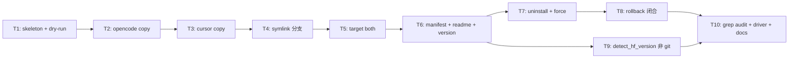

# HarnessFlow 安装脚本（Cursor / OpenCode）任务计划

- 状态: 草稿
- 主题: install.sh / uninstall.sh 实现拆解
- 关联 design: `features/001-install-scripts/design.md`（approved 2026-05-11）
- 关联 ADR: `docs/decisions/ADR-007-install-scripts-topology-and-manifest.md`（accepted）
- Workflow Profile: full
- Execution Mode: auto

## 1. 概述

本计划承接 design.md §18 给出的 T1–T10 拆分，把每个 task 写实成 INVEST-compliant 单元，每个 task 含 Acceptance / Files / Verify / 完成条件 / 测试设计种子，对齐 design §16 的 12 个 e2e scenario（6 矩阵 + 6 额外）。

每个 task 完成定义 = 对应 scenario PASS（或 design.md 中明示的更窄判定）。Walking Skeleton 路径 = T1 → T2 走通最薄端到端（opencode copy 单 scenario）。

## 2. 里程碑

| ID | 名称 | 包含任务 | 退出标准 | 追溯 |
|---|---|---|---|---|
| M1 | Walking Skeleton（opencode copy） | T1, T2 | scenario #1 PASS；scenario #8（dry-run）PASS | spec FR-001 FR-005 FR-008；design §16 |
| M2 | 双 target × 双 topology 矩阵 | T3, T4, T5 | scenario #3 / #4 / #5 / #6 PASS | spec FR-001 FR-002；design §16 |
| M3 | manifest + uninstall + rollback | T6, T7, T8 | scenario #7 / #9 / #12 PASS（HYP-002 Blocking 验证） | spec FR-003 FR-004 FR-006 NFR-002；design §11 §13 |
| M4 | ASM-001 + NFR-004 audit | T9, T10 | scenario #10 / #11 PASS | spec ASM-001 NFR-004；design §11 detect_hf_version |
| M5 | doc 同步 | T10（部分）| doc-freshness gate 通过 | spec §6；design §18 步骤 10 |

## 3. 文件 / 工件影响图

**新建**：

- `install.sh`（仓库根，bash，可执行 `chmod +x`）
- `uninstall.sh`（仓库根，bash，可执行）
- `tests/test_install_scripts.sh`（仓库根 `tests/` 目录，端到端测试入口；按 design §16.1 决策落点）
- `tests/fixtures/`（如需 fixture 文件；目前不预设）

**修改**：

- `docs/cursor-setup.md`（§1.B vendor 段落替换为指向 `install.sh`，保留手动 fallback；§3 verify 步骤里的"23 个" stale 文本 → "24 个"）
- `docs/opencode-setup.md`（§1.B / §1.C vendor 段落同上替换；§2 verify 步骤里 stale 数字 → "24 个"；新增 install.sh 路径条目）
- `README.md`（新增"Install scripts"段，指向 `install.sh` / `uninstall.sh`）
- `README.zh-CN.md`（同步中文段）
- `CHANGELOG.md`（在 `## [Unreleased]` 段新增 Added/Changed entries）
- `features/001-install-scripts/progress.md`（live update）
- `features/001-install-scripts/README.md`（live update）

**只读引用**：

- `skills/`（vendor 源）
- `.cursor/rules/harness-flow.mdc`（vendor 源）
- `.opencode/skills`（HF 仓库内的 symlink，不动）

## 4. 需求与设计追溯

| Task | spec 锚点 | design 锚点 |
|---|---|---|
| T1 | FR-001 / FR-005 | §11 parse_args / op() / log() / err() |
| T2 | FR-001 / FR-008 / NFR-001（部分） | §11 vendor_skills_opencode（copy） + mark_will_create |
| T3 | FR-001 / FR-008 | §11 vendor_cursor（copy） |
| T4 | FR-002 | §11 topology=symlink 分支 |
| T5 | FR-001（target both） | §11 顺序调用 |
| T6 | FR-003 / ASM-001 | §11 write_manifest / write_readme / detect_hf_version；§13 manifest schema + readme sample |
| T7 | FR-004 / FR-006 | §10 uninstall.sh 函数列表 + apply_removal parent vs leaf 区分；§13 颗粒度段 |
| T8 | NFR-002 | §11 set -Eeuo + mark_will_create + rollback rm -rf；§17 |
| T9 | ASM-001 完整 | §11 detect_hf_version git/CHANGELOG fallback |
| T10 | NFR-004 + spec §6 | design §16.3 #10 grep audit；docs 同步 |

## 5. 任务拆解

### T1. install.sh 骨架：参数解析 + dry-run + log/err/op

- 目标: 让 `bash install.sh --target opencode --topology copy --host /tmp/host --dry-run` 退出码 0 且不在 `/tmp/host` 写任何文件
- Acceptance:
  - Given 干净 `/tmp/host`，When `bash install.sh --target opencode --dry-run --host /tmp/host`，Then 退出码 0；`find /tmp/host` 输出空；标准输出含 "[MKDIR]" / "[CP]" 等行
  - Given 缺 `--target`，When 执行脚本，Then 退出码 1 + usage 文本 to stderr
- 依赖: 无（首个任务）
- Ready When: 该 feature branch 上 install.sh 不存在
- 初始队列状态: ready
- Selection Priority: 1（Walking Skeleton 起点）
- Files / 触碰工件: 新建 `install.sh`
- 测试设计种子:
  - 主行为: dry-run 不写文件
  - 关键边界: 缺 `--target` → exit 1
  - fail-first 点: 第一个 RED test 是 scenario #8（dry-run 无副作用）
- Verify: `bash tests/test_install_scripts.sh --only=8`（在 T10 落地，本任务先用 ad-hoc 命令）
- 预期证据: 命令输出 + exit code
- 完成条件: scenario #8 PASS

### T2. vendor_skills_opencode (copy) + mark_will_create

- 目标: scenario #1 PASS（opencode copy 完整安装）
- Acceptance:
  - Given 干净 `/tmp/host` + `bash install.sh --target opencode --host /tmp/host`，When 执行完毕，Then 退出码 0；`find /tmp/host/.opencode/skills -mindepth 2 -maxdepth 2 -name SKILL.md \| wc -l` ≥ 24
- 依赖: T1
- Ready When: T1 完成条件 PASS
- 初始队列状态: pending
- Selection Priority: 2
- Files / 触碰工件: `install.sh`（新增 `vendor_skills_opencode()` + `mark_will_create()`）
- 测试设计种子:
  - 主行为: SKILL.md 数量 ≥ 24
  - 关键边界: 宿主已有 `.opencode/` → mark_will_create 跳过登记
  - fail-first 点: 用 readonly host 触发 cp 失败 → 验证 trap 触发（部分 NFR-002，完整覆盖在 T8）
- Verify: `bash tests/test_install_scripts.sh --only=1`
- 完成条件: scenario #1 PASS

### T3. vendor_cursor (copy)

- 目标: scenario #3 PASS（cursor copy）
- Acceptance:
  - Given 干净 `/tmp/host` + `bash install.sh --target cursor --host /tmp/host`，Then `/tmp/host/.cursor/harness-flow-skills/` 含 ≥ 24 SKILL.md + `/tmp/host/.cursor/rules/harness-flow.mdc` 存在
- 依赖: T2（共用 `mark_will_create()`）
- Ready When: T2 完成
- 初始队列状态: pending
- Selection Priority: 3
- Files / 触碰工件: `install.sh`（新增 `vendor_cursor()`）
- 测试设计种子:
  - 主行为: 同上
  - 关键边界: 宿主已有 `.cursor/rules/`（用户已有 cursor rule）→ 跳过登记
- Verify: `bash tests/test_install_scripts.sh --only=3`
- 完成条件: scenario #3 PASS

### T4. topology=symlink 分支（opencode + cursor）

- 目标: scenario #2 + #4 PASS
- Acceptance:
  - `--target opencode --topology symlink` → `readlink /tmp/host/.opencode/skills` 解析回 HF_REPO/skills
  - `--target cursor --topology symlink` → `.cursor/harness-flow-skills` 与 `.cursor/rules/harness-flow.mdc` 都是 symlink
- 依赖: T2 + T3
- Ready When: T2 + T3 完成
- 初始队列状态: pending
- Selection Priority: 4
- Files / 触碰工件: `install.sh`（topology 分支扩展）
- 测试设计种子:
  - 主行为: readlink 解析正确
  - 关键边界: HF_REPO 是 symlink 自身被调用时，`SCRIPT_DIR` 解析到 canonical 路径（参考 ECC install.sh 的 readlink while loop）
  - fail-first 点: 跨文件系统 ln -s（design §17 已说明不自动降级，错误应明确提示）
- Verify: `bash tests/test_install_scripts.sh --only=2,4`
- 完成条件: scenario #2 + #4 PASS

### T5. --target both

- 目标: scenario #5 + #6 PASS
- Acceptance:
  - `--target both --topology copy` → scenario #1 + #3 同时满足
  - `--target both --topology symlink` → scenario #2 + #4 同时满足
- 依赖: T4
- Ready When: T4 完成
- 初始队列状态: pending
- Selection Priority: 5
- Files / 触碰工件: `install.sh`（顺序调用 vendor_skills_opencode + vendor_cursor）
- 测试设计种子:
  - 主行为: 两套路径同时就位
  - 关键边界: vendor_cursor 失败时 vendor_skills_opencode 已成功的部分应被 rollback（接 T8 的 rollback 闭合性）
- Verify: `bash tests/test_install_scripts.sh --only=5,6`
- 完成条件: scenario #5 + #6 PASS

### T6. write_manifest + write_readme + detect_hf_version (git path)

- 目标: 所有 install scenario 在结束时落 manifest + readme；scenario #1 / #3 / #5 验证 manifest schema 完整
- Acceptance:
  - install 完成后 `<host>/.harnessflow-install-manifest.json` 是合法 JSON，含 `manifest_version: 1` / `installed_at` / `hf_commit`（git SHA）/ `hf_version`（CHANGELOG 解析）/ `target` / `topology` / `entries[]`
  - copy topology 下 entries[] 含**每个** hf-* + using-hf-workflow 单独一条 dir entry（共约 25 条）+ parent dir 一条；symlink topology 下 entries[] 含 `symlink:.opencode/skills` 单条
  - `<host>/.harnessflow-install-readme.md` 存在，含 design §13 列出的 4 条 verify 命令骨架 + uninstall 命令 + cursor rule 注记
- 依赖: T2 / T3 / T4 / T5
- Ready When: T5 完成
- 初始队列状态: pending
- Selection Priority: 6
- Files / 触碰工件: `install.sh`（新增 `write_manifest()` / `write_readme()` / `detect_hf_version()`）
- 测试设计种子:
  - 主行为: manifest schema 字段齐全 + readme 存在
  - 关键边界: copy topology 的 per-skill entries 颗粒度（important finding 1 fix 验证锚点）
  - fail-first 点: 故意省略 `manifest_version` → JSON parse 仍可读（保持向前兼容空间）
- Verify: `bash tests/test_install_scripts.sh --only=1,3,5`（manifest 验证段重跑）
- 完成条件: scenario #1 / #3 / #5 中 manifest 验证段 PASS

### T7. uninstall.sh + scenario #7 + #9 (force)

- 目标: HYP-002 Blocking 验证用例 #7 PASS（user-skill 保留）+ #9 PASS（force 重装）
- Acceptance:
  - Given install (opencode copy) 完成 + 在 `/tmp/host/.opencode/skills/my-own-skill/SKILL.md` 手动放非 HF skill，When `bash uninstall.sh --host /tmp/host`，Then HF 25 个 skill 子目录被 rm -rf；`/tmp/host/.opencode/skills/my-own-skill/SKILL.md` **仍存在**；`.opencode/skills/` 父 dir 因仍含 my-own-skill 自然非空，`rmdir` 静默失败 → 保留；manifest + readme 被删；exit 0
  - Given install 已成功一次，When 不带 `--force` 再次 install，Then 退出 1 + 提示 "manifest 已存在"
  - Given install 已成功一次，When 带 `--force` 再次 install，Then 第一次 install 的所有 entries 被反向清理后第二次 install 完整就位；新 manifest installed_at 晚于旧
- 依赖: T6
- Ready When: T6 完成
- 初始队列状态: pending
- Selection Priority: 7
- Files / 触碰工件: 新建 `uninstall.sh`；`install.sh` 新增 `detect_existing_manifest()` 与 `--force` 路径
- 测试设计种子:
  - 主行为: user-skill 保留（HYP-002 Blocking）
  - 关键边界: PARENT_DIRS 列表对 `.opencode/skills` / `.cursor/harness-flow-skills` / `.cursor/rules` 三条 path 用 rmdir-only；其余 dir entry 用 rm -rf
  - fail-first 点: 缺 manifest → uninstall exit 1 + 明确提示
- Verify: `bash tests/test_install_scripts.sh --only=7,9`
- 完成条件: scenario #7 + #9 PASS

### T8. rollback 闭合 + scenario #12

- 目标: scenario #12 PASS（NFR-002 中途失败回滚）
- Acceptance:
  - Given `/tmp/host` 父目录设为只读使 `mkdir .opencode` 失败，When 执行 install，Then 退出码非 0；`find /tmp/host` 等于 install 前快照；无残留 manifest/readme
  - 同样模拟一次 cp 中途失败（在 cp 第 5 个 skill 时模拟 disk full，可用 `LD_PRELOAD` 或更简单的 `chmod -w` 中间触发），rollback 应清掉前 4 个 skill 子树 + 父 dir
- 依赖: T7
- Ready When: T7 完成
- 初始队列状态: pending
- Selection Priority: 8
- Files / 触碰工件: `install.sh`（确认 `set -Eeuo pipefail` + `trap rollback ERR INT TERM` + `rollback()` 用 `rm -rf` 处理 dir）
- 测试设计种子:
  - 主行为: rollback 后宿主 == install 前
  - 关键边界: rollback 中遇 `rm` 失败（FS 锁）→ `|| true` 兜底 + 明确 err() 提示
  - fail-first 点: 模拟整个 `vendor_skills_opencode()` 内部 cp 失败 → 验证 ERR trap 跨函数触发（验证 set -E）
- Verify: `bash tests/test_install_scripts.sh --only=12`
- 完成条件: scenario #12 PASS

### T9. detect_hf_version 完整逻辑（含非 git checkout fallback）

- 目标: scenario #11 PASS（ASM-001 非 git 降级）
- Acceptance:
  - Given HF_REPO 是 zip 解压（`rm -rf <HF_REPO>/.git` 模拟），When 执行 install，Then exit 0；manifest `hf_commit` = `unknown-non-git-checkout`；`hf_version` = 一个合法 SemVer 字符串（从 CHANGELOG 顶部 `## [X.Y.Z]` 解析；regex 自然跳过 `## [Unreleased]`）
- 依赖: T6
- Ready When: T6 完成（与 T7/T8 并行可执行）
- 初始队列状态: pending
- Selection Priority: 9
- Files / 触碰工件: `install.sh`（`detect_hf_version()` 完整 grep + sed）
- 测试设计种子:
  - 主行为: 非 git 时 hf_commit 降级为 `unknown-non-git-checkout`
  - 关键边界: CHANGELOG 顶部恰好是 `[Unreleased]` 段时 `hf_version` 从下一行 `[X.Y.Z]` 解析
  - fail-first 点: CHANGELOG 不存在 → `hf_version` = "unknown" 但 install 不 fail
- Verify: `bash tests/test_install_scripts.sh --only=11`
- 完成条件: scenario #11 PASS

### T10. NFR-004 grep audit + tests/test_install_scripts.sh 落地 + docs 同步

- 目标: scenario #10 PASS + tests/ 目录 e2e 入口完整 + 文档同步
- Acceptance:
  - `(awk '!/^[[:space:]]*#/' install.sh uninstall.sh) | grep -E '\b(jq|python|node|npm)\b'` 输出空
  - `tests/test_install_scripts.sh` 实现 12 个 scenario 的统一 driver，可用 `--only=N1,N2,...` flag 跑子集；不带 flag 跑全部
  - `docs/cursor-setup.md` §1.B / §3 verify、`docs/opencode-setup.md` §1.B / §1.C / §2 verify、`README.md` / `README.zh-CN.md` / `CHANGELOG.md` 已同步
- 依赖: T1..T9 全部完成
- Ready When: T9 完成
- 初始队列状态: pending
- Selection Priority: 10
- Files / 触碰工件: 新建 `tests/test_install_scripts.sh`；修改 5 个 doc 文件
- 测试设计种子:
  - 主行为: 12/12 scenario PASS，grep audit clean
  - 关键边界: docs 中 stale "23 个 hf-*" 全部更新为 "24 个" + grep 不到旧文本残留
  - fail-first 点: docs 改之前先在 doc-freshness gate 演练时 fail，再补 doc → pass
- Verify: `bash tests/test_install_scripts.sh`（12/12 PASS）
- 预期证据: tests/ 输出 + 文档 diff
- 完成条件: 12/12 scenario PASS + doc-freshness gate 通过

## 6. 依赖与关键路径

**关键路径**：T1 → T2 → T3 → T4 → T5 → T6 → T7 → T8 → T10（9 个 task）；T9 与 T7/T8 可并行（依赖 T6 完成）。

## 7. 完成定义与验证策略

每个 task 的 DoD = 其 Acceptance 全部 PASS + 对应 scenario PASS（见 Verify 行的 `bash tests/test_install_scripts.sh --only=N`）。

整体验证：T10 完成时 `bash tests/test_install_scripts.sh` 全 12 PASS + grep audit clean。

## 8. 当前活跃任务选择规则

- **首个 Active Task**: T1（唯一 ready 状态的 task）
- **当前 task 完成后选下一个**: 由 hf-workflow-router 在 hf-completion-gate 通过后基于以下规则选：
  1. 选 dependency 全部完成且未完成的 task 中 `Selection Priority` 最小的一个
  2. 若多个 task 同优先级且依赖均满足（如 T9 与 T8 同时 ready），选 priority 数字小的；本计划中 T8 priority=8 / T9 priority=9，所以 T8 先做
  3. 任一 task acceptance fail 时，先回 hf-test-driven-dev fix，再选下一个

## 9. 任务队列投影视图

不单独维护 task-board.md（任务量 10 < 阈值，本 tasks.md 直承）。当前队列状态：

| Task | 优先级 | 依赖 | 状态 |
|---|---|---|---|
| T1 | 1 | - | ready |
| T2 | 2 | T1 | pending |
| T3 | 3 | T2 | pending |
| T4 | 4 | T2, T3 | pending |
| T5 | 5 | T4 | pending |
| T6 | 6 | T2, T3, T4, T5 | pending |
| T7 | 7 | T6 | pending |
| T8 | 8 | T7 | pending |
| T9 | 9 | T6 | pending |
| T10 | 10 | T1..T9 | pending |

Task Board Path: N/A（任务量小，本 tasks.md 直承）

## 10. 风险与顺序说明

- **风险 1**：T8 rollback 测试需要模拟 cp 中途失败，跨平台模拟方法不一（macOS / Linux / alpine）。Mitigation：T8 测试用最简单的"父目录只读"触发 mkdir 失败（所有平台行为一致）；更深的 partial cp 失败留作 v0.6+ 加强测试。
- **风险 2**：T9 的"删 .git 模拟非 git checkout"在测试时需要先 cp -R 整个 HF 仓库到 tmp（避免污染原 HF 仓库），耗时较长（HF skills 总 < 5MB，应 < 2s）。Mitigation：测试 driver 用 trap EXIT 清理 tmp。
- **风险 3**：T10 docs 同步可能与 main branch 上其他正在进行的文档变更冲突。Mitigation：本 feature 的 doc 改动只针对 install 段，不动其他段；冲突由 git rebase 解决。
- **顺序刚性**：T1→T2 是 Walking Skeleton，必须先完成；T6 必须早于 T7（manifest 是 uninstall 唯一权威源）；T8 必须晚于 T7（rollback 闭合性需要在已有 vendor 路径基础上验证）。
