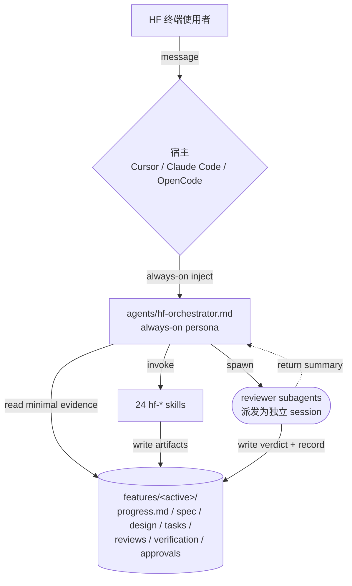
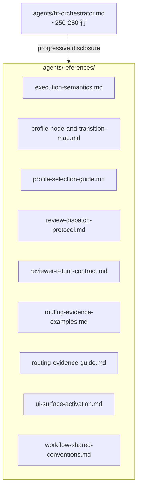
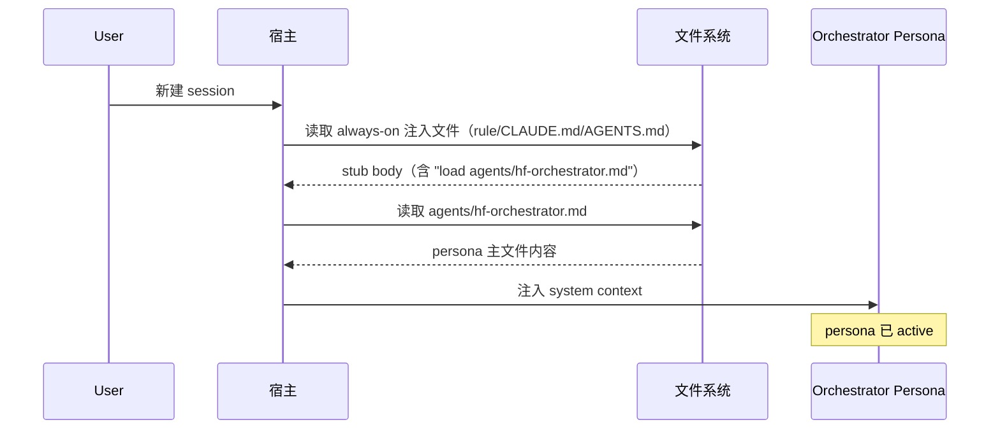
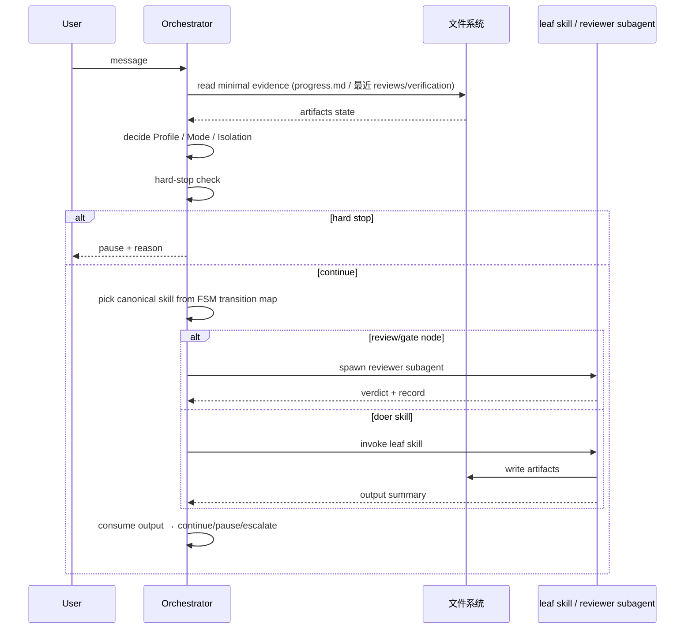

# HF Orchestrator Extraction & Skill Decoupling 实现设计

- 状态: 草稿
- 主题: 把 workflow 编排从 leaf skill 抽出为 always-on agent persona（v0.6.0 范围 = ADR-007 D3 Step 1）
- 上游 spec: `features/001-orchestrator-extraction/spec.md`（已批准）
- 上游 ADR: `docs/decisions/ADR-007-orchestrator-extraction-and-skill-decoupling.md`（候选；本 design 不修改）
- 上游 review handoff: `features/001-orchestrator-extraction/reviews/spec-review-2026-05-10.md` Round 2 末尾 4 项交接

## 1. 概述

把 `using-hf-workflow` (entry shell, 179 lines) + `hf-workflow-router` (runtime authority, 180 lines) + `hf-workflow-router/references/` (9 个 reference 文件，约 1797 lines) **物理迁移** 到一个新的 always-on agent persona 目录 `agents/`，作为 single source of truth。旧位置保留 redirect stub。

**变化的本质**：物理位置变化 + 单源化，**不改变** 任何路由 / 评审 / 派发 / FSM 转移语义。所有现有 leaf skill 行为不变。

设计核心是回答 **spec-review Round 2 交接 4 项**：

1. **HYP-005 dispatch 协议目标态设计** —— v0.7.0+ 不依赖 leaf 的 `Next Action` hint，纯靠 on-disk artifacts；v0.6.0 兼容期允许同时消费 leaf 残留字段
2. **NFR-001 wall-clock baseline schema** —— 3 宿主同口径采集
3. **FR-002 / FR-006 sub-ID 拆任务取舍**
4. **OQ-N-003 regression-diff 脚本归属**

## 2. 设计驱动因素

| 来源 | 驱动 |
|---|---|
| spec FR-001 | orchestrator persona 文件，**语义**等价合并改写 |
| spec FR-002.a/b/c/d | 三宿主 always-on stub + identity gate |
| spec FR-003 | 等价语义保留（walking-skeleton 回归） |
| spec FR-004 | 旧 skill 转 deprecated alias |
| spec FR-005 | ADR-007 锁定 |
| spec FR-006 / FR-007 | README / setup docs / CHANGELOG 同步 |
| spec NFR-001 | wall-clock × 1.20 量化判定 |
| spec NFR-002 | 字符数 × 1.10（基于现有合并 baseline）|
| spec NFR-003 | 旧路径外部消费者不 404 |
| spec NFR-004 | Reviewer/Author 分离纪律保留 |
| spec NFR-005 | 容许差异白名单稳定 |
| ADR-007 D1 (生效阶段) | v0.6.0 = architectural commitment（leaf 不动；新 leaf 必须遵循）；v0.7.0+ = runtime enforcement |
| ADR-007 D2 | `agents/` + `agents/references/` 是新引入的目录类别 |
| ADR-007 D4 | `using-hf-workflow` / `hf-workflow-router` 兼容期保留 |

## 3. 需求覆盖与追溯

| Spec 编号 | Design 章节 |
|---|---|
| FR-001 | § 9 选定方案 + § 10 视图 + § 11 模块职责 |
| FR-002.a/b/c/d | § 11 Host stub / § 13 接口契约（Cursor / Claude Code / OpenCode）|
| FR-003 | § 16 测试与验证策略 + § 11 walking-skeleton 回归 |
| FR-004 | § 11 Deprecated alias 模块 + § 13 alias body 契约 |
| FR-005 | ADR-007（不在本 design 修改）|
| FR-006 / FR-007 | § 11 Docs sync 模块 |
| NFR-001 | § 14 NFR QAS 承接（Time Behaviour）+ § 16 测试策略 |
| NFR-002 | § 14（Resource Utilization）+ § 13 字符数验证契约 |
| NFR-003 | § 11 Deprecated alias + § 14（Compatibility） |
| NFR-004 | § 11 Reviewer dispatch 模块 + § 14（Maintainability） |
| NFR-005 | § 16 regression-diff 脚本契约 |
| HYP-002 / HYP-003 (release-blocking) | § 16 测试策略（实施时验证）|
| HYP-005 (dispatch) | § 9 关键决策 D-Disp + § 13 dispatch 契约 |

## 4. Domain Strategic Model

**本 Context 不做战略建模，理由**：本 feature 的 Bounded Context 数量 = 1（orchestrator agent persona 自身）；无跨 Context 交互；spec 涉及概念全部已在现有 HF 文档体系中（router transition map / reviewer dispatch / Profile / Execution Mode 等），术语一致；不存在跨 Context 翻译需求。强行做战略建模会让"灵活性绑定到错误的轴上"（违反 design SKILL.md *Emergent vs Upfront Patterns*）。

## 4.5 Tactical Model

**本 Context 不做战术建模，理由**：触发条件无一满足（Bounded Context = 1；单文件 + references 无多实体 + 跨实体一致性约束；orchestrator 决策是无状态函数 `(user_msg, on_disk_state) → next_skill | pause | done`，无并发修改 / 事务边界；reviewer dispatch 是同步 spawn，不产生 Domain Event）。orchestrator 实质是一份 markdown persona，不是有状态领域对象。

## 5. Event Storming Snapshot

`lightweight` 档：自然语言描述。

orchestrator agent 在每个 user message 发生以下事件序列：

1. **Session Start (host)**：宿主把 `agents/hf-orchestrator.md` 自动注入 system context（事件：`OrchestratorPersonaLoaded`）
2. **User Message Received**：父会话收到一条 user message
3. **Evidence Read**：orchestrator 读取最少必要 on-disk evidence（progress.md / 最近 reviews / spec / design / tasks artifacts）
4. **Profile / Mode / Isolation Decided**：orchestrator 决定 Workflow Profile（full/standard/lightweight）+ Execution Mode（interactive/auto）+ Workspace Isolation（in-place/worktree-required/worktree-active）
5. **Hard Stop Check**：是否命中 hard stop（approval / evidence conflict / escalation trigger / completion-gate human confirmation）
6. **Canonical Skill Picked OR Pause**：若非 hard stop → 从 FSM 转移表决定 canonical 节点；若 hard stop → 暂停等待
7. **Skill Invoked OR Reviewer Dispatched**：调用 leaf skill / 派发 reviewer subagent
8. **Skill Output Consumed**：消费 leaf 输出；决定 continue / pause / escalate
9. **Loop Back to 2 OR Done**

无异常路径分叉——异常状态全部归到事件 5 的 hard stop 处理。

## 6. 架构模式选择

**Front Controller Pattern (GoF / Fowler PEAA)** —— orchestrator 是 HF workflow family 的统一入口点。沿用现有 `using-hf-workflow` 已声明的 *Front Controller Pattern* 立场（见原 `using-hf-workflow/SKILL.md` Methodology）。本 design 不引入新模式。

**对照 emergent vs upfront**：本设计前置的是**架构层 invariant**（三层架构 / Front Controller），不是 GoF 代码模式（Strategy / Factory 等不被前置）。orchestrator persona 文件本身的内部 dispatch 选择（如何根据 evidence 选 skill）由 markdown 自然语言决定，不需要代码层模式。

## 7. 候选方案总览

| 方案 | 描述 | 状态 |
|---|---|---|
| **A. 单文件**（all-in-one） | orchestrator.md 把所有 router references 内联，~2156 行 | 剪枝 |
| **B. 主文件 + references**（progressive disclosure） | orchestrator.md ~250-300 行作主轮廓，9 reference 物理迁到 `agents/references/` | **采用** |
| **C. 主文件 + 选择性内联**（hybrid） | 把 5 个高频 references 内联到主文件，其余 4 个迁到 `agents/references/` | 剪枝 |

## 8. 候选方案对比

| 维度 | A. 单文件 | B. 主文件 + references | C. 选择性内联 |
|---|---|---|---|
| **NFR-002 字符数对比 baseline × 1.10**（核心 release-blocking） | 主文件 ~2156 行 ≈ 80–90KB → 远超 baseline × 1.10（baseline 是合并的 359 行 SKILL.md，约 14KB） | 主文件 ≤300 行 ≈ ≤12KB → 严格优于 baseline（only `using-hf-workflow + hf-workflow-router/SKILL.md` 合并，~14KB），符合 NFR-002 | 主文件 ~600-800 行 ≈ ~30KB → **超出** baseline × 1.10 |
| **Token 预算（每 session）** | 高 | **低** | 中 |
| **Progressive disclosure** | 无 | **有**（reference 按需 read） | 部分 |
| **物理迁移成本** | 1 个文件 | **9 个 reference + 1 主文件** | 5 内联 + 4 迁出，不一致 |
| **维护一致性** | 单文件不会漂移 | 主文件 + reference 由同一目录权威，不漂移 | 内联 vs 迁出边界标准不清，易漂移 |
| **对 spec FR-001 "语义等价" 影响** | 完全等价 | **完全等价**（progressive disclosure 在原 router 已有，本设计沿用） | 完全等价但需声明哪些内联 |
| **对 ADR-007 D2 "single source" 影响** | 满足 | **满足** | 部分满足（内联部分仍需 redirect stub 处理） |
| **walking-skeleton 回归（HYP-002）** | 等价 | **等价** | 等价 |

**B 选定理由**：唯一同时满足 NFR-002 字符数预算 + ADR-007 D2 单源原则 + progressive disclosure（与现状 router 一致）+ 维护一致性的方案。

## 9. 选定方案与关键决策

### 9.1 方案 B 摘要

```
agents/
├── hf-orchestrator.md            (新增，~250-280 行；目标 ≤ 300 行 tentative aim)
└── references/                    (新增；progressive disclosure 子目录)
    ├── execution-semantics.md          (从 hf-workflow-router/references/ 物理迁出)
    ├── profile-node-and-transition-map.md
    ├── profile-selection-guide.md
    ├── review-dispatch-protocol.md
    ├── reviewer-return-contract.md
    ├── routing-evidence-examples.md
    ├── routing-evidence-guide.md
    ├── ui-surface-activation.md
    └── workflow-shared-conventions.md
```

旧位置在 v0.6.0 转 redirect stub：

```
skills/using-hf-workflow/SKILL.md                  (~30 行 redirect stub，含 description "deprecated alias")
skills/hf-workflow-router/SKILL.md                 (~30 行 redirect stub)
skills/hf-workflow-router/references/*.md          (每个 ~10 行 redirect stub，body "see agents/references/<same-name>.md")
```

### 9.2 关键决策（每条对应一个 ADR-007 sub-decision 或本 design 的 D-X 决策）

| 决策 ID | 决策 | 来源 | 可逆性 |
|---|---|---|---|
| **D-Layout** | 方案 B：主文件 + references 子目录 | 本 design § 8 trade-off | 可逆（可在 v0.7.x 调整粒度）|
| **D-Disp** | Dispatch 协议**目标态**：纯 on-disk artifact 驱动；orchestrator 读 `features/<active>/progress.md` + `reviews/` + `verification/` + spec/design/tasks artifacts，**不依赖** leaf 输出的 `Next Action` 字段；`Next Action` 字段在 v0.6.0 兼容期内仍可读作辅助 hint，但不作权威。**实施分阶段**：v0.6.0 = 设计目标态 + 实施时双向支持（继续读 leaf 的 `Next Action` 但不强制 leaf 提供）；v0.7.0+ = 删 leaf 的 `Next Action` 字段（D3 Step 5），orchestrator dispatch 协议自然进入纯 artifact 驱动 | HYP-005；ADR-007 D1 生效阶段 + D3 | 不可逆（架构边界）|
| **D-Mig** | 9 个 reference 文件**物理迁移**到 `agents/references/`；旧位置每个保留 ≤ 10 行 redirect stub | ADR-007 D2 单源 + D4 兼容期 | 物理迁移可逆（git 操作）|
| **D-Stub** | 旧 skill 转 deprecated alias 的 stub body **形式契约**：开头一段说明"v0.6.0 起本 skill 已迁出，权威位置 `agents/hf-orchestrator.md`"；中段给出"如果你点这个链接，请改读 `agents/...`"指引；不超过 30 行（C-006）；frontmatter `description` 含 "deprecated alias, see agents/hf-orchestrator.md" | spec FR-004 / NFR-003 / C-006 | 可逆（v0.7.0+ 删除时 stub 跟着删）|
| **D-Stub-Marker** | redirect stub 顶部标识符：用 HTML comment `<!-- HF v0.6.0 deprecated alias: see agents/hf-orchestrator.md -->` 作为机器可识别的 deprecation marker；后续 ADR 若需扫描 deprecated alias 可识别此 marker | NFR-003 + 未来 audit-agent-anatomy 候选 | 可逆 |
| **D-Host-Cursor** | Cursor 引导 stub 通过修改现有 `.cursor/rules/harness-flow.mdc` body 实现（不新建 mdc 文件）；保留 frontmatter；body 改为指向 `agents/hf-orchestrator.md` 的 always-on load 指令 | spec FR-002.a；NFR-001 (Time Behaviour) | 可逆 |
| **D-Host-CC** | Claude Code 引导走**双轨**：(a) 新建仓库根 `CLAUDE.md` 含 always-load redirect；(b) 同时在 `.claude-plugin/plugin.json` 注册 orchestrator agent（如 schema 支持 `alwaysActive` 等价字段；不支持时仅靠 (a)）。优先用 (a) 保证最低保障，(b) 是优化 | spec FR-002.b；C-005 schema fallback | 可逆 |
| **D-Host-OC** | OpenCode 引导走 `AGENTS.md` 仓库根 always-load。若已有 `AGENTS.md` 则在顶部追加 "## HF Orchestrator (always on)" 段，不覆盖现有内容；若无则新建 | spec FR-002.c | 可逆 |
| **D-Identity** | orchestrator persona 自报身份段（用于 NFR-001 + FR-002.d identity gate）落到 `agents/hf-orchestrator.md` 主文件**第 2 段**（H1 后第一段），含一句 "I am the HF Orchestrator (HarnessFlow workflow family always-on agent persona, see ADR-007)" 等价中文。该段是机器可 grep 的 invariant，作为 smoke test 的硬锚点 | NFR-001 + FR-002.d | 可逆但建议长期保留 |
| **D-NFR1-Schema** | NFR-001 wall-clock baseline schema：每宿主分别采集 (a) baseline-orchestrator-loaded（`agents/hf-orchestrator.md` 已自动注入） + (b) baseline-legacy（仅 `using-hf-workflow + hf-workflow-router` SKILL.md 注入，本测量为模拟，因为旧路径在 v0.6.0 已转 stub）。**简化**：因 v0.6.0 旧路径已转 stub，无法在同一 commit 测两者；改为 schema = "v0.5.1 (旧路径) HEAD"上的 wall-clock 作为 baseline，"v0.6.0 (新路径) HEAD" 上的 wall-clock 作为 candidate；测量在两个 git checkout 间分别跑。每宿主 5 次重复取均值；输出 raw + ratio 写入 `verification/load-timing-3-clients.md` | NFR-001；spec-review R2 交接 #2 | 可逆 |
| **D-RegrLoc** | walking-skeleton regression-diff 脚本物理位置 = `features/001-orchestrator-extraction/scripts/regression-diff.py`（**不**放 `skills/hf-finalize/scripts/`）。理由：脚本只为本 feature 一次性验证使用，**不**属于 hf-finalize SOP 的组成部分；ADR-006 D1 4 类子目录约定中 `skills/<name>/scripts/` 是 skill-owned 工具，本脚本不符合；feature-scoped 一次性脚本落 `features/<NNN>/scripts/`。如未来证明该脚本通用化（被多个 feature 复用），后续 ADR 可以把它升级为 skill-owned | OQ-N-003；spec-review R2 交接 #4；ADR-006 D1 | 可逆（升级路径清楚）|
| **D-RegrImpl** | regression-diff.py = stdlib-only Python 3 脚本，对照 v0.5.1 walking-skeleton 产物（`examples/writeonce/features/001-walking-skeleton/closeout.md` + `closeout.html` + `verification/*.md` + `evidence/*.log`）和 v0.6.0 同位置产物，做 schema-by-schema diff；容许差异白名单硬编码为正则集合 `{时间戳模式, 生成器脚本路径文本片段, HTML 渲染时间戳模式}`；exit 0 + stdout "PASS" 当且仅当所有差异落在白名单 | NFR-005；FR-003 | 可逆 |
| **D-FR2-Tasks** | FR-002 sub-ID 拆任务策略（spec-review R2 交接 #3）：在 `hf-tasks` 阶段拆为 4 个独立任务（Task-002a Cursor stub / Task-002b Claude Code stub + plugin / Task-002c OpenCode stub / Task-002d Identity check verification）。理由：每个宿主的修改面 / 验收路径 / 失败模式独立；并行任务调度更高效；任一宿主失败不阻塞其它宿主完成。FR-006 类似拆为 2 个（README ×2 + setup docs ×3）。详细拆解由 hf-tasks 阶段执行 | spec-review R2 交接 #3 | 可逆 |
| **D-Skip-DDD** | 不做 Domain Strategic Modeling 与 Tactical Modeling | § 4 / § 4.5 显式说明 | 不可逆（决策入档）|
| **D-Skip-Threat** | 不做 STRIDE 威胁建模 | § 15 详述 | 可逆（如未来发现威胁面再补）|

## 10. 架构视图

### 10.1 C4 Context



### 10.2 Container（agents/ 内部）



### 10.3 Component（orchestrator persona 主文件结构）

主文件章节顺序（为保持等价改写，沿用 router + entry shell 现有结构）：

1. Frontmatter (`name: hf-orchestrator` + `description`)
2. Identity 段（NFR-001 / FR-002.d identity gate 锚点；D-Identity）
3. Operating Loop（10 步；从 router § 1-10 + entry shell § 1-7 合并改写）
4. Hard Stops 列表
5. Workflow Profile 决策入口（详细规则指 `agents/references/profile-selection-guide.md`）
6. Execution Mode 决策入口（指 `references/execution-semantics.md`）
7. Workspace Isolation 决策入口（指 `references/workflow-shared-conventions.md`）
8. FSM 转移表入口（指 `references/profile-node-and-transition-map.md`）
9. Reviewer Dispatch 入口（指 `references/review-dispatch-protocol.md` + `reviewer-return-contract.md`）
10. Skill Catalog（24 个 hf-* + 1 entry-shell-deprecated 的 description-line 索引；表格形式）
11. Output Contract（最小输出 schema；与 router § Output Contract 等价）
12. Red Flags
13. Common Rationalizations
14. Verification 自检清单

## 11. 模块职责与边界

| 模块 | 路径 | 职责 | 不做 |
|---|---|---|---|
| Orchestrator main | `agents/hf-orchestrator.md` | always-on persona 自报身份 + operating loop + 决策入口 + skill catalog | 不内联完整 FSM 表 / 不内联 reviewer protocol |
| References | `agents/references/*.md` | 详细规则按需 read | 不重复主文件结论；不互相引用形成环 |
| Cursor stub | `.cursor/rules/harness-flow.mdc`（修改现有）| Cursor session always-on inject 指针 | 不内联 persona 内容 |
| Claude Code stub | `CLAUDE.md`（仓库根，新增或追加段）| Claude Code session always-on inject 指针 | 不内联 persona 内容 |
| Claude Code plugin | `.claude-plugin/plugin.json`（修改）| 注册 orchestrator agent；schema 不支持时降级 | 不替代 `CLAUDE.md` |
| OpenCode stub | `AGENTS.md`（仓库根，新增或追加段）| OpenCode session always-on inject 指针 | 不内联 persona 内容 |
| Deprecated alias - skills | `skills/{using-hf-workflow,hf-workflow-router}/SKILL.md` | redirect stub ≤ 30 行；frontmatter `description` 标 deprecated | 不删除文件物理位置（v0.7.0+ 才删） |
| Deprecated alias - references | `skills/hf-workflow-router/references/*.md` | redirect stub ≤ 10 行 / 文件 | 不删除文件物理位置 |
| Walking-skeleton regression script | `features/001-orchestrator-extraction/scripts/regression-diff.py` | stdlib-only Python 3；diff v0.5.1 vs v0.6.0 walking-skeleton 产物 | 不入 `skills/<name>/scripts/`（D-RegrLoc） |
| Verification records | `features/001-orchestrator-extraction/verification/{regression-2026-05-XX.md, smoke-3-clients.md, load-timing-3-clients.md}` | 落盘 implement 阶段 fresh evidence | 不在 design 阶段预填 |
| Docs sync - README | `README.md` + `README.zh-CN.md` Scope Note | 在顶部 Scope Note 加 v0.6.0 段 | 不重写 Workflow Shape / 其它 README 段 |
| Docs sync - setup | `docs/{cursor,claude-code,opencode}-setup.md` | "如何启用 HF" 段从"加载 entry shell + router"改为"orchestrator 自动加载" | 不动其它 setup 段 |
| Docs sync - CHANGELOG | `CHANGELOG.md` `[Unreleased]` 段 | 加 v0.6.0 Added / Changed / Decided / Notes 子段 | 不动历史 release 段 |
| Plugin manifest | `.claude-plugin/{plugin.json, marketplace.json}` | version `0.5.1` → `0.6.0`；description 同步 | 不改 schema 形态 |
| Project metadata | `SECURITY.md` Supported Versions / `CONTRIBUTING.md` 引言版本号 / `.cursor/rules/harness-flow.mdc` Hard rules 版本号 | v0.5.1 → v0.6.0 | 不改其它内容 |

## 12. 数据流、控制流与关键交互

### 12.1 Always-On 加载流（启动时一次性）



### 12.2 Operating Loop（每条 user message 一次）



### 12.3 Dispatch 协议目标态（v0.7.0+；D-Disp 关键决策）

orchestrator 决策"下一步调谁"的输入仅 4 类 on-disk artifact，**不**消费 leaf skill 的 `Next Action` 字段：

1. `features/<active>/progress.md` 的 `Current Stage` / `Workflow Profile` / `Execution Mode` / `Pending Reviews And Gates` / `Current Active Task`
2. `features/<active>/{spec.md, design.md, tasks.md}` 的 frontmatter 状态字段（draft / approved）
3. `features/<active>/reviews/*.md` 最新 review 记录的 `结论` + `结构化 JSON`
4. `features/<active>/verification/*.md` 最新 fresh evidence

**v0.6.0 兼容期**：orchestrator 实施时仍读 leaf skill 输出中的 `Next Action Or Recommended Skill` 字段作为 hint（可加速决策），但若该字段缺失或与 on-disk artifact 冲突，**以 artifact 为权威**。这是 ADR-007 D1 生效阶段 "v0.6.0 = architectural commitment" 的具体落实。

## 13. 接口、契约与关键不变量

### 13.1 Orchestrator persona 主文件契约

- **Path**: `agents/hf-orchestrator.md`
- **Frontmatter**: `name: hf-orchestrator` + `description: HF workflow orchestrator. Always-on agent persona; auto-loaded per session in Cursor / Claude Code / OpenCode.`
- **第 2 段**（identity gate）必须含 grep 锚点字符串 `"I am the HF Orchestrator"` 或等价中文 `"我是 HF Orchestrator"`
- **NFR-002 字符数预算**：`wc -c agents/hf-orchestrator.md` ≤ `wc -c skills/{using-hf-workflow,hf-workflow-router}/SKILL.md` × 1.10

### 13.2 References 文件契约

- **Path**: `agents/references/<name>.md`，`<name>` 与 `skills/hf-workflow-router/references/<name>.md` 严格对应（同名）
- **内容**: 与原文件**逐字节相同**（git mv 等价），除非有 wording 修订（本 design 不引入 wording 修订）
- **不变量**: orchestrator 主文件中所有"详细规则见 ..."引用必须指向 `agents/references/<name>.md`，**不**指向旧路径

### 13.3 Deprecated alias stub 契约

- **path**: `skills/{using-hf-workflow,hf-workflow-router}/SKILL.md`
- **frontmatter**: 保留 `name`；`description` 重写为 `description: deprecated alias, see agents/hf-orchestrator.md`
- **顶部第一行**: HTML comment marker `<!-- HF v0.6.0 deprecated alias: see agents/hf-orchestrator.md -->`
- **body 结构**:
  - H1 `# <name> (deprecated alias)`
  - 一段 deprecation notice（v0.6.0 起；权威位置；为什么迁出）
  - 一段 redirect 指引（"如果你点这个链接，请改读 `agents/hf-orchestrator.md`"）
  - 可选：one-liner 兼容期保留时间窗口（v0.6.0 → v0.7.0+ 物理删除）
- **Total**: ≤ 30 行

References stub（`skills/hf-workflow-router/references/*.md`）：
- ≤ 10 行
- HTML comment marker
- H1 + 一句 redirect "see `agents/references/<same-name>.md`"

### 13.4 Host always-on stub 契约

| 宿主 | 文件 | 关键内容 |
|---|---|---|
| Cursor | `.cursor/rules/harness-flow.mdc` (修改 body) | 保留 `alwaysApply` 等价 frontmatter；body 顶部说明"本 workspace 自动以 HF orchestrator persona 启动"+"Read `agents/hf-orchestrator.md` immediately and act as that persona"；保留 § "Hard rules (do not bypass)" 但更新版本号 v0.5.1 → v0.6.0 |
| Claude Code | `CLAUDE.md` (新增或追加段) | "## HF Orchestrator (always on)" 段：1 句解释 + "Read `agents/hf-orchestrator.md` and adopt that persona" 指令 |
| Claude Code plugin | `.claude-plugin/plugin.json` (修改) | `version: "0.5.1"` → `"0.6.0"`；新增 `agents` 字段（schema 形如 `[{"name": "hf-orchestrator", "alwaysActive": true, "source": "agents/hf-orchestrator.md"}]`；如 schema 不接受降级为只 bump version） |
| OpenCode | `AGENTS.md` (新增或追加段) | "## HF Orchestrator (always on)" 段：与 Claude Code stub 同形 |

### 13.5 Walking-skeleton regression diff 脚本契约

- **Path**: `features/001-orchestrator-extraction/scripts/regression-diff.py`
- **Inputs** (CLI args):
  - `--baseline-dir <path>`：v0.5.1 walking-skeleton 产物目录（默认 `examples/writeonce/features/001-walking-skeleton/` 在 v0.5.1 commit 上）
  - `--candidate-dir <path>`：v0.6.0 同位置产物目录
- **依赖**: stdlib only（`difflib` / `re` / `sys` / `pathlib`）
- **容许差异白名单**（硬编码）:
  - `r"\b\d{4}-\d{2}-\d{2}\b"` 时间戳
  - `r"\b\d{2}:\d{2}:\d{2}\b"` 时间戳
  - `r"scripts/render-closeout-html\.py|skills/hf-finalize/scripts/render-closeout-html\.py"` 生成器脚本路径迁移痕迹
  - `r"<!--\s*Rendered at .*?-->"` HTML 渲染时间戳
- **Output**: stdout 含 "PASS" 或 "FAIL"；exit 0 当且仅当 PASS
- **判定语义**: schema-by-schema 比对 closeout.md H2 段、Evidence Matrix、State Sync、Release/Docs Sync、Handoff、Refactor Note；差异落在白名单或为空 → PASS

## 14. 非功能需求与 QAS 承接

| NFR | 来源 spec QAS | 设计承接（模块/机制/observability/验证）|
|---|---|---|
| **NFR-001 加载延迟 × 1.20** | Stimulus: 新建 session；Response: persona 加载完成；Measure: wall-clock × 1.20 | 模块: Host stub × 3；机制: 宿主原生 always-on 注入（不引入额外 mechanism）；observability: `verification/load-timing-3-clients.md` raw + ratio；验证: D-NFR1-Schema 中规定 5 次重复 / git checkout v0.5.1 vs v0.6.0 / 3 宿主 × 2 group 共 30 次测量 |
| **NFR-002 字符数 × 1.10** | Resource Utilization；Measure: `wc -c agents/hf-orchestrator.md` ≤ `wc -c skills/{...}/SKILL.md` 合计 × 1.10 | 模块: Orchestrator main；机制: progressive disclosure（references 不计主文件）；observability: `wc -c` 输出；验证: hf-test-driven-dev RED 阶段 commit-time check |
| **NFR-003 旧路径不 404** | Compatibility / Co-existence；Measure: 旧文件可读 + 含 redirect 指引 | 模块: Deprecated alias × 2 + references stub × 9；机制: 物理保留 + frontmatter `deprecated alias` + body redirect；observability: `ls skills/{using-hf-workflow,hf-workflow-router}/`；验证: hf-test-driven-dev 实施时检查文件存在 + grep "see agents/" |
| **NFR-004 Reviewer/Author 分离** | Maintainability + Functional Correctness；Measure: review record 100% 含"独立 reviewer subagent"标识 | 模块: Reviewer dispatch 入口（orchestrator persona § 9）；机制: 沿用现有 `agents/references/review-dispatch-protocol.md`（迁出版）；observability: review record 文件；验证: walking-skeleton 回归 + 任一新 review 节点检查标识 |
| **NFR-005 容许差异白名单稳定** | Maintainability / Testability；Measure: 自一致性 + mutation 测试 | 模块: regression-diff.py；机制: 硬编码正则白名单；observability: 脚本 stdout / exit code；验证: hf-test-driven-dev TDD 同时跑（Given baseline 跑两次自一致性 / Given mutation 跑应 FAIL）|

## 15. Threat Model (STRIDE)

**触发条件检查**：
- Spec 有 Security NFR？无
- 跨信任边界？无（HF persona 在用户本地宿主内运行；不引入新外部依赖；不处理 secrets）
- 处理 PII / 敏感数据？无

**结论**：不触发 STRIDE 必填条件。本轮不做威胁建模。

## 16. 测试与验证策略

### 16.1 最薄端到端验证路径（Walking Skeleton）

实施 step-by-step：

1. 物理迁移 9 个 reference 文件 + 创建 orchestrator main + 修改 3 宿主 stub + 转 deprecated alias
2. 跑 walking-skeleton：使用现有 `examples/writeonce/features/001-walking-skeleton/` 作为 baseline；理论上 closeout pack 应该与 v0.5.1 等价（容许白名单差异）
3. 跑 `regression-diff.py`：必须 PASS
4. 3 宿主 smoke test：每宿主新启 session，输入 "who are you"；agent 必须含 "I am the HF Orchestrator" / "我是 HF Orchestrator" 标识

### 16.2 NFR 验证矩阵

| NFR | 验证机制 | 落盘位置 |
|---|---|---|
| NFR-001 | wall-clock 测量脚本 + 人工或自动化采集 | `verification/load-timing-3-clients.md` |
| NFR-002 | `wc -c` commit-time check | `verification/regression-2026-05-XX.md` evidence section |
| NFR-003 | `ls` + `grep` 检查 deprecated alias | 同上 |
| NFR-004 | walking-skeleton review record 检查 | 同上 |
| NFR-005 | regression-diff.py 自一致性 + mutation | 同上 |

### 16.3 Release-Blocking 假设验证（HYP-002 / HYP-003）

- HYP-002（artifact production rate not regressed）→ NFR-005 + walking-skeleton diff PASS
- HYP-003（3 宿主 always-on 加载）→ NFR-001 + smoke test PASS

两条均**必须**在 v0.6.0 release 通过 hf-completion-gate 前有 fresh evidence。

## 17. 失败模式与韧性策略

| 失败模式 | 影响 | 缓解 |
|---|---|---|
| Cursor `.cursor/rules/harness-flow.mdc` body 修改后某 IDE 版本不正确加载 | session 启动后 orchestrator 未注入 | 沿用现有机制（v0.5.1 已被验证），仅改 body 内容；如真实失败 → 立即回滚到 v0.5.1 stub 内容 + 走 hf-hotfix |
| Claude Code plugin schema 不支持 `alwaysActive` | plugin manifest 注册 fail | 降级到 `CLAUDE.md` 唯一保障路径（D-Host-CC fallback 已在设计） |
| OpenCode `AGENTS.md` 已有重要内容被覆盖 | 项目元数据丢失 | 实施时**追加段**而非覆盖；hf-test-driven-dev 阶段 RED 测试先 grep 现有 AGENTS.md 是否存在 |
| 旧 references stub 文件丢失（未保留） | 外部消费者 404 | hf-test-driven-dev 阶段每个 reference stub 都要 commit；hf-test-review 阶段 reviewer 检查 9 个文件均存在 |
| regression-diff.py 把不该容许的差异列入白名单 | 假阴性 | NFR-005 mutation 测试拦截；reviewer 阶段额外检查正则覆盖范围 |
| NFR-001 wall-clock 测量在 CI / 本地差异过大 | 容许阈值不适用 | 本轮接受人工 5 次本地测量（spec § 3 Instrumentation Debt 已声明）；自动化推迟到 v0.7+ |

## 18. 任务规划准备度

下列内容已稳定到 hf-tasks 可直接拆任务（spec FR + design D-X 决策互证）:

- 14 个具体模块（§ 11 表格）→ 每个模块对应一个或多个任务
- 4 个交接事项已落地（D-Disp / D-NFR1-Schema / D-FR2-Tasks / D-RegrLoc）
- 主要并行度：3 宿主 stub 任务可并行（D-FR2-Tasks）；deprecated alias 与 orchestrator main 之间有先后顺序（main 先建，否则 stub redirect 目标不存在）
- 关键路径：orchestrator main → 3 宿主 stub（并行）→ deprecated alias（含 references stub）→ regression-diff.py → walking-skeleton 实跑 → docs sync → CHANGELOG → version bump

## 19. 关键决策记录（ADR 摘要）

本 design 的 12 条 D-X 决策（§ 9.2 表）**不**新建仓库级 ADR（ADR-008+），而是作为 ADR-007 的 design-stage 实施细化记录在本 design.md。理由：

- 这些决策都是 ADR-007 D1–D7 的物理实施选择，非独立架构决策
- 新建 ADR-008（含 12 条 D-X）会让 ADR pool 膨胀；HF 的 ADR 节奏是"一个 ADR 锁一个跨版本立场"
- 若后续 design-review 认为某条 D-X 应升级为独立 ADR（如 D-Disp 的 dispatch 协议规范），可单独立 ADR-008+

仓库级 ADR pool（`docs/decisions/`）本轮**只**新增 ADR-007（已在 spec PR #42 起草）；本 design 不动 ADR pool。

## 20. 明确排除与延后项

承接 spec § 6.2 全部 12 项 + 加入本 design 衍生的：

- **不**做 dispatch 协议的形式化（schema / type / DSL）—— v0.6.0 仍用 markdown 表达；如未来 orchestrator 需要程序化 dispatch（如脚本 lint），再开 ADR-008
- **不**自动化 NFR-001 wall-clock 测量；本轮人工 5 次重复（spec Instrumentation Debt 已声明）
- **不**为 `agents/` 目录引入 anatomy audit（与 `audit-skill-anatomy.py` 等价的 `audit-agent-anatomy.py`）—— ADR-007 D2 已显式留待后续 ADR 决定
- **不**新增 specialist personas（reviewer / debugger 专家等）—— ADR-007 D7
- **不**引入 dispatch 协议的双向通信（leaf 主动通知 orchestrator）—— 单向 spawn-and-consume 模型不变

## 21. 风险与开放问题

### 阻塞项

无（spec § 13 阻塞项 = 无；本 design 未引入新阻塞问题）。

### 非阻塞项

- **OQ-D-001**: `CLAUDE.md` 与 `.claude-plugin/plugin.json` 双轨注册是否会引起 Claude Code 加载冲突（如 agent 加载两次）？倾向不会（每条机制只作用一次），但 hf-test-driven-dev 阶段 smoke test 时需关注；如冲突，降级到只用 `CLAUDE.md`（D-Host-CC fallback）。
- **OQ-D-002**: walking-skeleton baseline 用 v0.5.1 commit 还是 v0.5.0 commit？倾向 v0.5.1（最新 stable），但需在 hf-tasks 阶段定测试 git checkout 顺序。
- **OQ-D-003**: 9 个 references 文件迁移使用 `git mv` 还是新建 + 删除？倾向 `git mv`（保留 git history 可追溯）；hf-tasks 阶段定。
- **OQ-D-004**: Orchestrator persona 主文件的"自报身份"段落是中文还是英文？两者都行；倾向英文（与 frontmatter 一致）+ 中文括号注解（兼容中文使用者 grep）；hf-tasks 阶段最终定。

---

## 状态同步

- 状态：草稿
- Current Stage：`hf-design`
- Next Action Or Recommended Skill：`hf-design-review`
